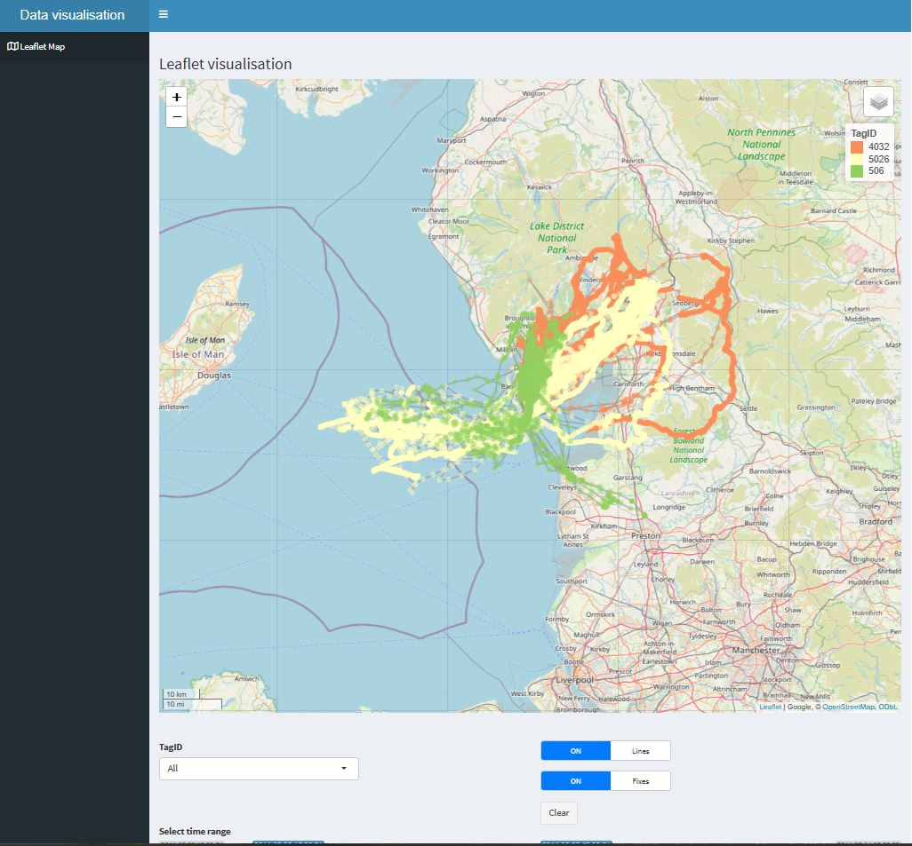
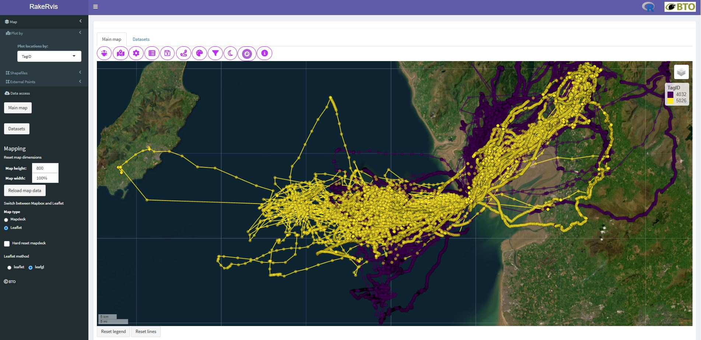
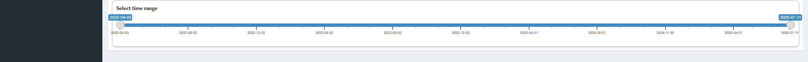
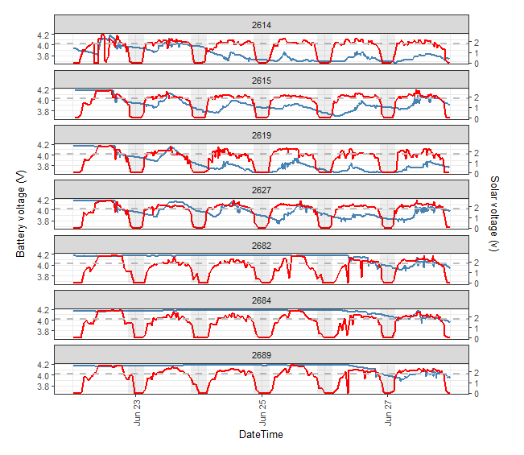
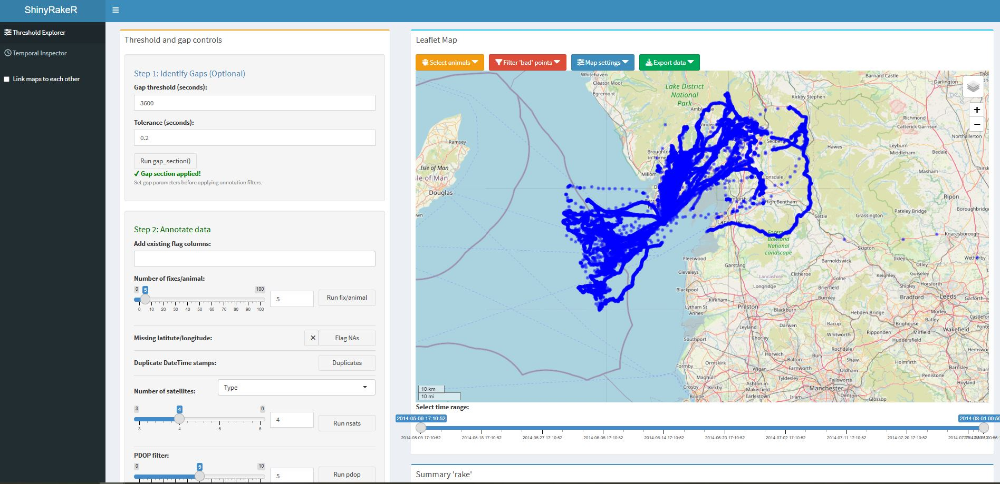
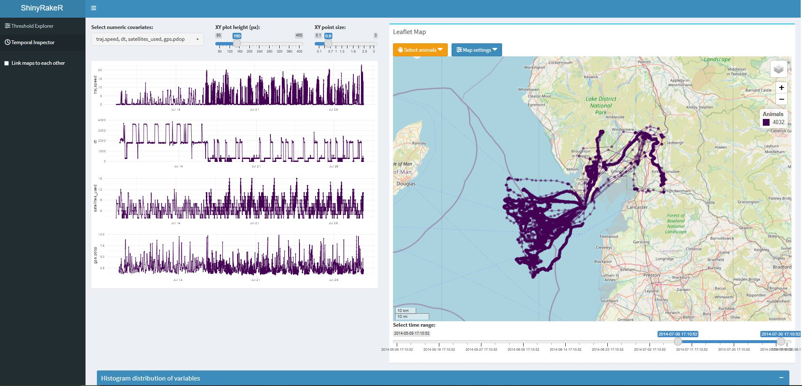

<!-- README.md is generated from README.Rmd. Please edit that file, but only with package maintainer's permission -->
  
# MoveRakeR

### Current version: 1.1.4

[](https://doi.org/10.5281/zenodo.15275175)


## Overview

`MoveRakeR` contains a collection of functions to help streamline data processing and common data wrangling tasks that often occurs with GPS tracking data. It operates at the initial stages after data acquisition. Although a number of R packages are now available for analysis of animal movement data (Joo et al. 2020), `MoveRakeR` tackles some fundamental data processing steps that are often encountered to help streamline data preparation ahead of further analytical steps. It is intended to support the other existing workflows in other R packages, such as `move` (Kranstauber et al. 2018) and `move2` (Kranstauber et al. 2024) and provides some further tools to address common manipulations of data routinely encountered that often require a degree of subjectivity in decision making. Should the user be interested in exploring location error in GPS devices in more detail, we would recommend the approach of Flemming et al. (2020) and the `ctmm` R package (Fleming & Calabrese 2023).

## Dependencies

`MoveRakeR` needs the following packages installed:

adehabitatLT,	dplyr,	tibble,	lubridate,	tidyr,	purrr,	data.table,	move,	RODBC, suncalc,
geosphere, DT, leaflet,	shiny, shinyWidgets, suncalc, htmltools, sf, sfheaders, sp, ggplot2, R.rsp, readr, 
flexdashboard, plotly, shinydashboard, shinyWidgets, shinybusy, DT, rmapshaper, units, magrittr and viridisLite.

## Installation

`MoveRakeR` is not yet available on CRAN therefore please install it by using:

``` r
devtools::install_github('BritishTrustForOrnithology/MoveRakeR', build_vignettes = TRUE)
```

## Vignettes

There is currently one vignette called _"Cleaning and Raking"_, that gives a more detailed overview of the initial error-checking and data annotation/filtering processes involved at the outset. Further vignettes will be added to show the overall layout and general usage of the package, initial read in and data handling, data manipulation, and defining trips. 

## Data

An example dataset will be added to the package for a small number of example Lesser Black-backed Gulls _Larus fuscus_ tracked from a breeding colony in the UK.

## Usage

`MoveRakeR` was borne out of seabird tracking work. Much of the focus of the package is on movements of tracked animals from a central place, used within numerous papers to date (e.g. Thaxter et al. 2015, Langley et al. 2021, Clewley et al. 2023, Thaxter et al. 2025, O'Hanlon et al. 2025). The `MoveRakeR` pipeline requires a dataset with the following columns: *TagID*, *DateTime*, *latitude* and *longitude*. The processing is built around a `Track` class object. This is not a strict requirement but aids in visualisation of printing, plotting and summarising.

``` r
data <- read.csv(data.csv,sep = ",", header=TRUE)
data <- Track(data)

summary(data)
plot(data) # slower for large datasets
tabulate_history(data)

```
The workflow within `MoveRakeR` and the further accompanying visualisation package `RakeRvis` is depicted below.


## Layout

The `MoveRakeR` workflow uses a number of functions. As there are a many of these, the below schematic outlines how these fit into the process.

{width=110%}

## Initial data read in

Data sourcing functions allow data to be read into R from databases, from MoveBank through the `read_track_MB()` function, and the University of Amsterdam Bird-tracking System database (UvA-BiTS) (Bouten et al. 2013), using the `read_track_UvA()` function. For the UvA-BiTS connection, you will need to first follow the steps outlined under `?read_track_UvA` to set up an ODBC connection using R package `RODBC`. The MoveBank login details are also required for use and create this calling:

``` r
library(RODBC)
db <- odbcConnect("GPS") # if you called your connection "GPS"

library(move)
login <- MoveBankLogin("username","password")
```

Then data can be read in using `read_track_UvA()` and `read_track_MB()` that allows concatenation of animal IDs 
and start/end times of sections of data required:

``` r
# UvA-BiTS
TagID <- c('1', '2', '3') # example birds
start <- c("2016-06-01 13:53:50", "2016-06-15 12:22:13", "2016-06-05 08:07:23") # example start times 
end <- c("2016-07-15 09:17:14", "2016-07-20 01:08:58", "2016-07-18 14:22:45") # example end times 
dataUvA <- read_track_UvA(TagID, start=start, end=end, pressure = FALSE) # reading in data

# MoveBank
TagID <- c('4', '5', '6') 
start <- c("2016-06-01 13:53:50", "2016-06-15 12:22:13", "2016-06-05 08:07:23")
end <- c("2016-07-15 09:17:14", "2016-07-20 01:08:58", "2016-07-18 14:22:45")
repo = "your_MoveBank_repo"
dataMB <- read_track_MB(TagID, start=start, end=end, repo = repo)
```

The MoveBank read in depends on the `move` package, which of course can be done directly using that package; the `read_track_MB()` function seeks to align different datasets to a common form for further combination. The raw MoveBank form of the data can be preserved if need be. Note also, that the read in for MoveBank data 
automatically filters out duplicate data - see also `move2` (Kranstauber et al. 2024) for more details of such filtering.

## Identifying initial data duplications

It is necessary early on in the workflow to check for duplicate data. This is to avoid pitfalls of carrying out initial sorting by timestamps within animals that could mask issues, such as sudden data jumps in time. The ```duplicate_track()``` function helps identify duplicate time streams of valid data and other duplication errors such as identical timestamps for the same xy position. However, care is needed to make sure the behaviour of duplication handling is as expected, and that location duplicates are not carrying other needed data alongside, such acceleration information. A means to resolve these duplicates are also provided, such as random selection of a duplicate or based on highest quality data from other columns in your data.

## Visualisation

`MoveRakeR` provides some built-in mapping options shaped around two `leaflet` `Shiny` apps. Firstly,  `plot_leaflet()` can allow visualisation of tracked animals, via:


``` r
plot_leaflet(data)

```


A second function is called `plot_leaflet_trips()` which visualises individual trips of animals in more detail with further tabs for data summaries. 

The user may also find useful a further R package for use alongside `MoveRakeR` called `RakeRvis`. This is a further `Shiny` app with detailed plotting functionality for neater visualisation using `leaflet`, `leafgl` and `mapdeck`, with further option to either load data or download data from MoveBank or UvA-BiTS. 

``` r
library(RakeRvis)
RakeRvis(data)

```





In `plot_leaflet()`, as also in `RakeRvis`, there are further options for plotting shapes, additional point shape layers (using the `sf` package), and options to *plotby* a different variable, e.g. a year, cohort, behaviour etc that you may have in your data; further coloration and point/line options are available. 

A generic S3 `plot` function for is also available for Track objects, which uses base R graphics and can 
be overlain on top static maps and shapefiles, with arrows indicating direction also included. For example:

``` r
ukmap <- sf::st_transform(ukmap, 4326) #n example base map of hour choice in geographic WGS84

# using the generic plot function for the S3 method for class 'Track' (which LBBGWalB201416 is)
Cpal <- grDevices::colorRampPalette(c("red", "green", "blue"))
par(mar=c(0,0,0,0))
plot(ukmap$geometry, xlim=c(-4.7,-2), ylim = c(53.2,54.5), col = "wheat", border= "wheat")
plot(data, anims = "uniq", 
     Lines = TRUE, 
     gap = FALSE,
     ADD=TRUE, 
     Legend = TRUE, 
     cex_p = 0.2, 
     col = Cpal, 
     p4s = 4326)
```

Should the user be interested in voltages, then these can also be plotted through an S3 generic plot function, that plots objects of class `Vo`. This is directly compatible with voltage data that can be accessed from the UvA-BiTS database, through the `read_voltage_UvA()` function. For use with wider `Track` data, if you have voltage and charing data in the same dataset, this can be coerced to a `Vo` object using the `Track2Vo` function. This visualisation may be useful to see how tags are performing, after deployment to check sustainability of sampling protocols, and can bevplotted alongside GPS data. Further options also exist to source acceleration and pressure data from UvA-BiTS directly into R. 

``` r
# This needs conversion to a Vo object first, where data is an object with TagID and DateTime columns:
Vo_obj = Track2Vo(data, vbat = "tag-voltage", vsll = "battery-charging-current")

Vo_obj_subset = Vo_obj[Vo_obj$TagID == "animal_1",] # subsetting one animal if wanted from Track data
track_data = data[data$TagID == "animal_1",]

# plot with Track data alongside for additional day/night bars, with a subset of time period
plot_st = plot(Vo_obj_subset, dataTrack = track_data, start = "2022-04-05 00:00:00", end = "2022-04-10 00:00:00")

```
An example plot below is shown from several animals of a separate dataset:



## Identifying further potential data issues (raking)

Thereafter, the task may involve understanding other potential sampling biases in your data, such as routine summaries of data amounts per animal through a `summary()` function, spatial/temporal spans of the data that you may have or expect a priori through the `data_spans()` function, and assessing density of fixes of animals through time and potential outlying individuals using `tag_timeline()`. You may be interested to understand likely tag sampling rates, that can be assigned through `assign_rates()`. Moreover, the spacing between sampling rates may vary considerably if the tag has stopped recording, for example due to low batter, necessitating identification of 'gaps' in your data, available through the `gap_section()` function. 

Movement validity can be assessed through checks of trajectory speed between two fixes, through the `speed_filt()` function. `MoveRakeR` offers flexibility and understanding around the sorts of filtering you may want to do, such as based on raw trajectory speed, e.g. assessing influencing of tag sampling rate using `tspeed_filt()`, and other averaging/smooths such as root mean square within `speed_filt()` - similar processes available in other R packages such as `trip` (see also Sumner 2011). 

Alternatively, the user may consider fixes directly unsuitable due to poor quality measurement, for example through too few satellites or DOP values - this is easily done outside of `MoveRakeR` but a function `filt_err()` is also available to help with this. Further measurement errors may also be apparent, linked to the devices themselves. It should be said `MoveRakeR` can help with some of these issues but it may be worth investigating outliers in the data using other R packages. For example, the `ctmm` package (Fleming & Calabrese 2023) through `ctmm::outlie()`,  uses available information on location error such as DOP values or number of satellites, as well as trajectory speed estimates (Flemming et al. 2020) in assessing potential error generation. A further function within `MoveRakeR` called `rake_outlie()` can also be used to look at potential measurement errors from variables in the data, exploring potential outlying data using boxplot, quantile or Hampel approaches to outlier detection.

The above steps span a process of initial error/outlier assessment and potential effects of removal of GPS data. This we term as "raking", a subset of what we may call data "cleaning". A further general function called `rake()` is also included to scan the data for potential issues, using most of the above processes, although deeper dives into your data are always advised. In addition, a further shiny app has also been included as a more interactive tool to examine and test some of these biases visually, called `ShinyRakeR`. This can be called as:


``` r
ShinyRakeR(data)

```

This app displays two main tabs, a threshold explorer and a temporal inspector, which can be synchronised. The threshold explorer is a means of annotating the data for potentially outlying fixes, the combined effects of which 
can be explored geographically using the leaflet map as well as individually, with visual and tabular breakdowns also evaluated for proportion of fixes affected by the choices at the animal level. Options for annotating include minimum numbers of GPS fixes per animal, duplicate data, minimum numbers of satellites, dilution of precision values, trajectory speeds, turning angles and spatial xy extents. Gaps in the data can be investigated where isolated fixes may be left.



The temporal inspector tab allows for visualisation of variables associated with the data through time as line plots, alongside a map. The histogram distribution of the variable chosen can be explored and a plot for the density of tracking data across animals through time is also displayed.



Among other packages, the `ExMove` toolkit (Langley et al. 2024) provides a Shiny App to investigate the effect of filter effects of speed and net displacement based on prior knowledge of the study system. 

### A temporary situation with a shiny update

Note, as of July 2025, there was an update to ```shiny``` and subsequent ```shinydashboard``` that affects the way menu items are coded. For functions such as ```ShinyRakeR``` there is a chance, depending on the versions of those packages you have, that apps may stall and complain about deprecation of *menuItems*. This has yet to be explored, but for now I suggest using a stable combination of those packages to run the shiny apps:

``` r
remotes::install_version("shiny", version = "1.8.1")
remotes::install_version("shinydashboard", version = "0.7.2")
 
# then
ShinyRakeR(data) # should work as intended - get in touch if not!
 
```

## Final "cleaning" 

Annotation or filtering of the data following data inspection can be made using the `clean_track()` function. This is a wider process similar to the threshold explorer tab of the `ShinyRakeR()` function, to flag a combined errant data label per row. `clean_track()` can also filter automatically for these decisions. For example:


``` r
clean_track(data = data, drop_sats = 3, sp_thres = 40, GAP = 28800, drop_single_gap = FALSE)

```

In previous `MoveRakeR` releases prior to version `1.1.4`, `clean_track()` was called `clean_GPS()` although the legacy code as the former function name is still included for backwards compatibility. This cleaning function process is a rather blunt instrument and we **strongly advise that `clean_track()` is not used out-of-the box using the defaults** but that a thorough investigation of your data is carried out using the above "raking" steps. The `clean_track()` function should be seen as a final all-encompassing shortcut to annotate or filter your data based on decisions that you are arrived at.

## Further data manipulation

A common task is to sub-sample GPS data to a common rate; this may be needed for further analytical steps
or to align data in some way. As with all these tasks, modelling solutions may exist to not require this step. However,`MoveRakeR` provides a sub-sampling algorithm `sub_samp()` that builds upon existing tools available in some other packages such as `AMT` (Signer et al. 2019) and `move` (Kranstauber et al. 2018), in particular including a bootstrap method to sub-sample data and maximise data availability, useful for animals traversing space for only a limited time such as on migration. Other approaches using interpolation and simulation are not provided in `MoveRakeR` for which other R packages are available to provide those operations, such as `adehabitatLT`, `move` and continuous-time movement modelling approaches such as `crawl` (Johnson et al. 2008) `ctmm` (Fleming & Calabrese 2023) and `aniMotum` (Jonsen et al. 2023).

Further annotation of the data is often required for central place foraging consideration. Metrics for an animal or population may be needed to assess how far typically animals move from their central place, how long trips are, and other metrics such as tortuosity, bearing, total distance and probably many others. The trips are first identified provided using function `define_trips()` using user-specified definitions of the central place such as a radius around a centre point, a rectangle or polygon to define the central place, or alternatively use of specific nest locations for individual animals; on the latter, nest locations may be known directly or perhaps where not, estimates from other approaches such as `nestR` (Picardi et al. 2020) or `recurse` (Bracis et al. 2019) may be informative; see also the `trip` package (Sumner et al. 2009, Sumner 2011). These locations are needed by the function to estimate where to measure the trip start/end point in space and time. The function `trip_stats()` can then be used to generate movement metric summaries of trips for each animal and the group of animals. Further tabulation functions are provided such as `tabulate_trips()` which takes the output from `trip_stats()` and summarise the information neatly. The `trip_stats()` function will return a new object of class `Trip`. The default of the `trip_stats()` function is to use the first and last fix of the animal within the central place boundary to compute trip duration and distances. 


``` r
newdata <- data %>% 
  clean_GPS(GAP = 3600*8, speedfilt = TRUE, drop = FALSE) %>% 
  sub_samp(dt=300, tol = 0.2, method = "sequencer") %>% # sub-sample data
  define_trips(method = "rect", lls = LLS, plot = TRUE, verbose = TRUE) # (e.g. LLS = c(-3.2, 54.0553,-3.1689, 54.0437))
  
plot_leaflet(newdata)

trips <- trip_stats(newdata) # a new dataset of individual trips using first and last known positions in CP
tabulate_trips(trips) # neater tabulation

# visualising individual trips
plot_leaflet_trips(newdata, trips = trips)

```

Note that complexities can arise for trips that are determined as arriving and then
departing again from the central place with a single shared GPS fix for starts and ends of trips. These are handled in `MoveRakeR` through duplicate row records, stored as an attribute from the `define_trips()` function. However should substantial data manipulation, such as base R processing, be carried out between these two functions being run, it is best to add these duplicate data directly into the data before such manipulation and ahead of `trip_stats()` being run; beware that this data will likely need removing again ahead of downstream analyses.

``` r

LLS <- c(-3.2, 54.0553)
newdata <- define_trips(data = data, method="circ", lls = LLS) %>%
   add_cag_trips() # this will add duplicate rows directly to the Track using  column "extra_row" 1 or 0.

### other potential data manipulation e.g.
newdata <- data.frame(newdata) # removes any attributes and Track data class

# trip_stats() can still be run given pseudo duplicate data directly included demarcate start/ends for all trips
trips <- trip_stats(newdata)

# but then best put the extra rows back as an attribute, removing them from the main Track data
newdata <- Track(newdata) %>% reset_cag_trips()

```

## Track-style layout of datasets

The `MoveRakeR` seeks to employ 'tidy' principles at heart, although further `data.table` and base R operations are also well-utilised. The use of `tibble` and `dplyr` ensured that operations were carried out at very least at the grouping of the animal level. However, in case further listed formats of data are wanted, the user can convert the `Track` data to a list of animals `TrackStack` or a further multi-list `TrackMultiStack` e.g. for separate stacks of years. These are just convenience functions to convert to base R operations.

## A word on the vertical dimension

The `MoveRakeR` package is mainly focused on xy position, but further functionality may be included for vertical assessment. For example assessing fix-to-fix changes in GPS altitude and whether any outlying points are worthy of considering as erroneous. Such consideration may be useful for considering the flight altitude of birds, but this is another topic that deserves separate consideration, and often includes modelling of such sources of error (Ross-Smith et al. 2016, Johnston et al. 2023).

## Other common tasks, offshore, distance to coast

These are all routine GIS operations, that `MoveRakeR` doesn't seek to replicate. However, 
should you wish to add a distinction for offshore and onshore (likely very specific circumstances) then
a function `offshore()` is available to annotate as a simple binary vector. Should you be interested in distance to coast as a metric for foraging trips, then `dist2coast()` is also provided, then can be fed through the `trip_stats()` routine. These functions depend on you definitions of the coastline for which an `sf` shape is provided to each function, with a buffer extent available to crop the overall shape for increased efficiency.

``` r

newdata <- data %>% 
  offshore(shape = shape_sf, crop = TRUE, buffer_extent = 10000, p4s = 3035) %>%
  dist2coast(shape = shape_sf, crop = TRUE, buffer_extent = 50000, p4s = 3035)

```

## Licensing

### Software License (Code)

The `MoveRakeR` R package source code is released under the MIT License.
This permits free use, modification, and redistribution of the code, including for commercial purposes.

### Data License (Included Datasets)

Any datasets included within this package are licensed separately under the
Creative Commons Attribution–NonCommercial 4.0 International (CC BY-NC 4.0) license.

This means:

- You are free to use, share, and adapt the data, but 
- Commercial use of the data is not permitted, and
- Attribution is required when the data are used or redistributed.

The non-commercial data license applies only to the included datasets and does not restrict use of the package code itself.

For full license texts, see: LICENSE (MIT license for code), and inst/extdata/data-license.txt (CC BY-NC 4.0 license for data).


## References

Bouten, W., Baaij, E.W., Shamoun-Baranes, J. & Camphuysen, K.C.J. (2013) A flexible GPS tracking system for studying bird behaviour at multiple scales. Journal of Ornithology, 54, 571–580. <https://doi.org/10.1007/s10336-012-0908-1>

Bracis, C., Bildstein, K.L. & Mueller, T. (2018) Revisitation analysis uncovers spatio-temporal patterns in 
animal movement data. Ecography. <https://doi.10.1111/ecog.03618>

Calenge, C. (2006) The package adehabitat for the R software: tool for the analysis of space and habitat use by animals. Ecological Modelling, 197, 516-519. <https://doi.org/10.1016/j.ecolmodel.2006.03.017>

Clewley, G.D., Thaxter, C., Scragg, E.S., Masden, E.A., Barber, L.J., Conway, G., Clark, N.A. & Burton, N.H.K. (2023) Daily, seasonal and annual variation in area use of Lesser Black-backed Gulls (*Larus fuscus*) related to offshore renewable developments. Bird Study, 70. <https://doi:10.1080/00063657.2023.2190080>

Cullen, J. (2020) R package ‘bayesmove’ v 0.1.0. <https://github.com/joshcullen/bayesmove>

Fleming, C.H., Drescher-Lehman, J., Noonan, M.J., Akre, T.S.B., Brown, D.J., Cochrane, M.M., Dejid, N., DeNicola, V., DePerno, C.S., Dunlop, J.N., Gould, N.P., Harrison, A.-L., Hollins, J., Ishii, H., Kaneko, Y., Kays, R., Killen, S.S., Koeck, B., Lambertucci, S.A., LaPoint, S.D., Medici, E.P., Meyburg, B.-U., Miller, T.A., Moen, R.A., Mueller, T., Pfeiffer, T., Pike, K.N., Roulin, A., Safi, K., Séchaud, R., Scharf, A.K., Shephard, J.M., Stabach, J.A., Stein, K., Tonra, C.M., Yamazaki, K., Fagan, W.F. & Calabrese, J.M. (2020) A comprehensive framework for handling location error in animal tracking data. bioRxiv 2020.06.12.130195. <https://doi.org/10.1101/2020.06.12.130195>

Fleming, C.H. & Calabrese, J.M. (2023). ctmm: Continuous-Time Movement Modeling. R package version 1.2.0. <https://CRAN.R-project.org/package=ctmm>

Johnson, D.S., London, J.M., Lea, M.-A. & Durban, J.W. (2008) Continuous-time correlated random walk model for animal telemetry data. Ecology, 89, 1208-1215. <https://doi:10.1890/07-1032.1>

Jonsen, I.D., Grecian, W.J., Phillips, L., Carroll, G., McMahon, C., Harcourt, R.G., Hindell, M.A. & Patterson, T.A. (2023) aniMotum, an R package for animal movement data: Rapid quality control, behavioural estimation and simulation. Methods in Ecology & Evolution, 14(3), 806-816. <https://doi.org/10.1111/2041-210X.14060>

Joo, R., Boone, M.E., Clay, T.A., Patrick, S.C., Clusella-Trulas, S. & Basille, M. (2020) Navigating 
through the R packages for movement. BES, 89, 248-267. <https://doi.org/10.1111/1365-2656.13116>

Kranstauber, B., Smolla, M., & Scharf, A. K. (2018). move: Visualizing and analyzing animal track data. R package version 3.1.0. <https://CRAN.R-project.org/package=move>

Kranstauber, B., Safi, S. & Scharf, A.K. (2024) move2: R package for processing movement data. Methods in Ecology  and Evolution, 15(9), 1561-1567. <https://doi.org/10.1111/2041-210X.14383>

Langley, L.P., Bearhop, S., Burton, N.H. Banks, A.N., Frayling, T., Thaxter, C.B., Clewley, G.D., Scragg, E. & Votier, S.C. (2021)  GPS tracking reveals landfill closures induce higher foraging effort and habitat switching in gulls. Movement Ecology, 9, 56 <https://doi.org/10.1186/s40462-021-00278-2>

O'Hanlon, N.J., Clewley, G.D., Johnston, D.T., Thaxter, C.B., Langlois Lopez S., Quinn, L.R., Boersch-Supan, P.H., Masden, E.A., Daunt, F., Wilson, J., Burton, N.H.K., Humphreys, E.M. Partial Niche Partitioning in Three Sympatric Gull Species Through Foraging Areas and Habitat Selection. Ecology & Evolution, 15(7), e71577 <https://doi.org/10.1002/ece3.71577>

Signer, J. Fieberg, J. & Avgar, T. (2019) Animal movement tools (AMT): R package for managing tracking data and conducting habitat selection analysis. Ecology and Evolution, 9, 880-890. <https://doi.org/10.1002/ece3.4823>

Sumner, M.D. (2011) The Tag Location Problem. Ph.D. thesis, University of Tasmania. <https://eprints.utas.edu.au/12273/3/sumner.pdf>.

Sumner, M.D., Wotherspoon, S.J. & Hindell, M.A. (2009) Bayesian estimation of animal movement from archival and satellite tags. PLoS ONE, 4(10). <http://dx.plos.org/10.1371/journal.pone.0007324>.

Thaxter, C.B., Ross-Smith, V.H., Bouten, W., Clark, N.A., Conway, G.J., Rehfisch, M.M. & Burton, N.H.K. (2015) Seabird–wind farm interactions during the breeding season vary within and between years: A case study of lesser black-backed gull *Larus fuscus* in the UK. Biological Conservation, 186 <https://doi.10.1016/j.biocon.2015.03.027>

Thaxter, C.B., Quinn, L., Atkinson, P., Booth Jones, K.A., Clark, N.A., Clewley, G.D., Green, R.M.W., O'Hanlon, N.J., Johnston, D.T., Masden, E.A., Ross-Smith, V.H., Sage, E., Scragg, E., Taylor, R., Burton, N.K.H. & Humpreys, E.H. 2025. Breeding and foraging habitat are important in determining foraging ranges of sympatric generalist species. Ibis <https://doi:10.1111/ibi.13446>


