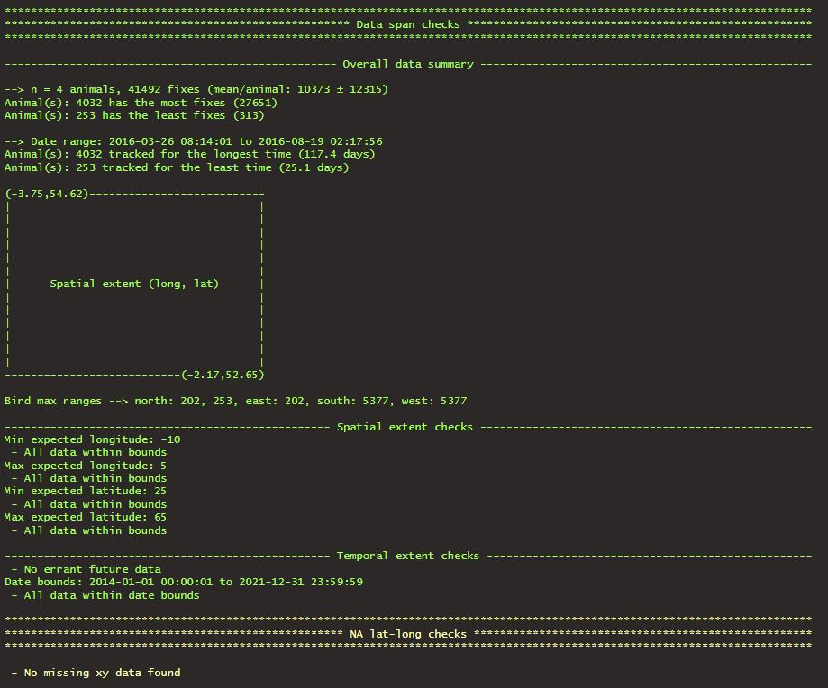
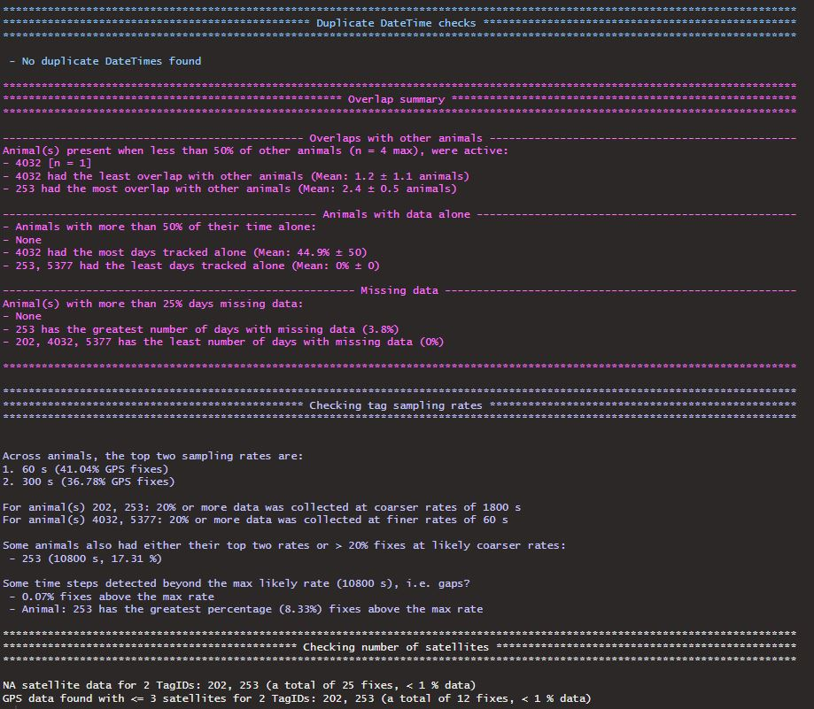
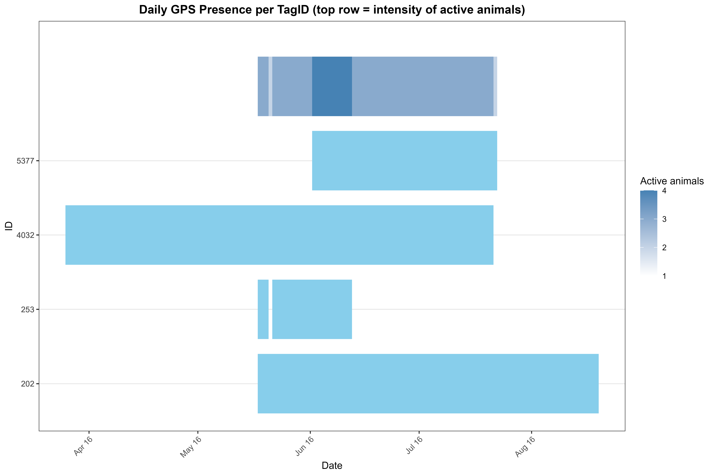
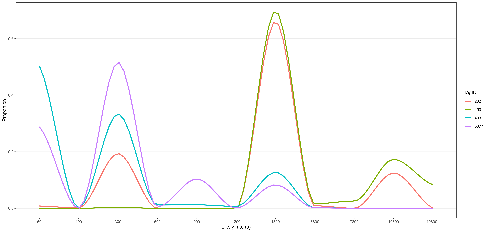
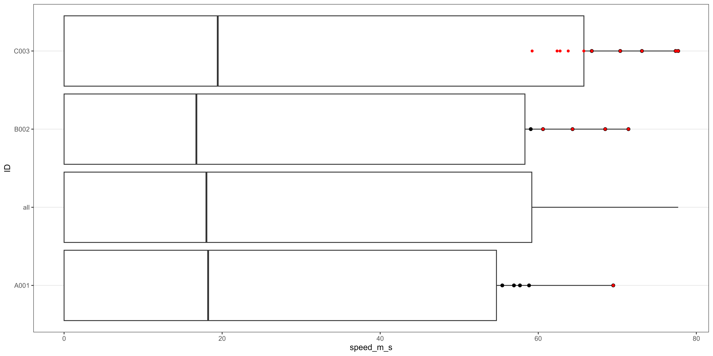

```{r setup, include=FALSE}
knitr::opts_chunk$set(echo = TRUE)

knitr::opts_chunk$set(
  collapse = TRUE,
  comment = "#>",
  eval = identical(Sys.getenv("NOT_CRAN"), "true")
)

```

## Introduction

There many reasons why animal-borne telemetry locations may have error. For location information received from GPS systems these can include internal firmware settings of tags relating to connection with satellites i.e. location quality, the number of satellites, their position in the sky, along with external factors such as temperature, humidity etc. Further issues relating to sampling biases such as  the sampling frequencies specified upon deployment of tags, and data gaps in coverage related to battery depletion or overall sampling set up, samples sizes of birds tracked and when in time they were studied. Further issues may relate to duplication of data received and missing or corrupted information. Together these issues combined present a challenge to analysts to identify, remove or account for such errors and biases ahead of addressing the intended research question. A series of tools are included in ```MoveRakeR``` to assist with this task.   

### Data appraisal 'raking'

The distinction is made in ```MoveRakeR``` between appraisal of the data and further annotation and filtering of unwanted errant GPS locations. Data appraisal includes understanding potential influences of choices made from labeling potentially erroneous data - this is termed 'raking' and typically comes ahead of then formally 'cleaning' of the data to annotate or remove such fixes based on that initial assessment. The two processes are of course closely linked.

An initial assessment of the data can be made through use of the ```rake()``` function which is a wrapper function calling various others that can also be used in isolation if need be. ```rake()``` also gives a print out to the R console of spans of tracking data, if NA latlongs are present, if any duplicate data are there and can assess a broad timeline assessment of when birds were tracked, and if there were times when fewer or more were tracked through calls to the standalone ```tag_timeline()``` function. The ```rake()``` function also gives the user an idea of the summary of data quality extent in space and time with the ```tag_spans()``` function, as well as idea of potential rates the GPS tags were set to through use of the ```assign_rates()``` function, and number of satellites used.

The ```rake()``` function has defaults to check for all elements noted above (xyt spans, NA latlongs, duplicate DateTimes, timelines, rates and number of satellites), detailed in the *check_for* argument. The overall ```rake()``` call is simply:


```{r MoveRakeR rake(), eval=FALSE, echo=TRUE}

rake_summary <- rake(data)

```

The call above would expect you to have a dataset loaded as 'data'. However, some functions are available in ```MoveRakeR``` to simulate some random data with an element of biological realism using function sim_data() that calls simulate_trip(). 

```{r MoveRakeR sim_data() example, eval=FALSE, echo=TRUE}
data <- sim_data(
  hub_lat = -54.5, hub_lon = -36.1, # central place 'hub'
  dt = 300, # seconds GPS rate
  animals = c("A001", "B002"),
  points_per_trip = 100,
  n_trips = 10,
  max_speed = 50, # m/s
  cp_time_mean = 5, # hours
  cp_time_sd = 1 # variation
)
```

It is advisable for the user to check carefully arguments within ```rake()``` to match checks required for the data at hand. This may look something like:

```{r MoveRakeR rake() full, eval=FALSE, echo=TRUE}

rake_summary <- rake(
  data,
  check_for = c("spans", "NAlatlong", "dupDT", "timeline", "rates", "nsats"),
  xra = c(-10, 5),
  yra = c(25, 65),
  dates = c("2014-01-01 00:00:01", "2021-12-31 23:59:59"),
  buffer_days = 2,
  max_show = 3,
  plot = FALSE,
  return_plot = TRUE,
  overlaps = TRUE,
  active_thresh = 0.5,
  alone_thresh = 0.5,
  miss_thresh = 0.25,
  breaks = c(1, 60, 100, 300, 600, 900, 1200, 1800, 3600, 7200, 10800),
  tol = c(0, 0.5, rep(0.4, 2), rep(0.3, 5), rep(0.2, 2)),
  pctn_rate_thresh = 20,
  sat_col = "satellites_used",
  drop_sats = 3,
  messages = TRUE,
  msg_col = c(32, 33, 34, 35, 36, 37)
)

```

The terminal window output should look something like the following (here using some 'real' data):

{width=80%}

{width=80%}

#### Data spans

Data span checks are carried out first starting simply by summarising the number of animals, fixes, and which animals had the most and least overall data by number of fixes, and also the duration of tracking with animals tracked for longest and shortest periods. The spatial extent bounded by the tracking data is given with animals that were responsible for the maximal data extremes (lat long WGS84). 

As part of these spatial checks, ```rake()``` uses the arguments *xra* and *yra* as two-length vectors for the min and max of the x and y ranges _expected_ for the data, which may or may not be known (i.e. as a way of potentially flagging up errant data that strays beyond an expecting extremity). Likewise, temporal bounds are given in the *dates* argument, which ```rake()``` checks data validity against, and thus needs consideration. Errant future data beyond the current R session datetime are also assessed.

The same initial part of the ```rake()``` output can be obtained with a call to the ```tag_spans()``` function: 

```{r MoveRakeR tag_spans(), eval=FALSE, echo=TRUE}

data_spans <- tag_spans(
  data,
  measure = c("general", "spatial", "temporal"),
  xra = c(-10, 5),
  yra = c(25, 65),
  dates = c("2014-01-01 00:00:01", "2021-12-31 23:59:59"),
  buffer_days = 2,
  tz = "UTC",
  max_show = 3,
  messages = TRUE,
  msg_col = 33
)

```

Here, more control is available to also specify which of the general, spatial and temporal measures are needed, along with those other arguments also specified in the ```rake()``` function. A buffer (*buffer_days*) is also provided either side of the DateTime window. As in the ```rake()``` function, output is returned to the user summarising the general, spatial and temporal components (see the ?help page ```tag_spans()``` for more details).

#### NA lat longs and duplicate DateTimes

Within ```rake()``` simple checks are performed on the data to detect missing xy information and/or duplicate DateTimes, and return that summary in the terminal window. No additional functions are used for these tests as they are relatively trivial and can be performed easily outside of ```MoveRakeR```.

#### Temporal overlaps between animals

Within ```rake()``` the function assesses temporal overlaps between animals in the supplied dataset. These tests use arguments supplied to the function. First, a test is performed for the animals that are present with less than X% of other animals were active, as a gauge to how sparse parts of the dataset are. This is controlled by the *active_thresh* proportion argument (between zero and 1). Animals with the least and most overlaps with other animals across their deployments are also quantified. Next, the function assess animals with more than Y% of the time alone, determined by the *alone_thresh* proportion argument. The animals with the most and least days tracked alone are also given. Finally, the ```rake()``` function gives an indication of potential missing data at the day level, by checking how many days of missing data are present in the GPS record, with the animals with more than Z% days - via the *miss_thresh** argument - of missing data determined, and again those animals with the most and least days of missing data. As above, ```rake()``` uses a worker function to achieve this ```tag_timeline()```, than can be called directly:

```{r MoveRakeR tag_timeline(), eval=FALSE, echo=TRUE}
data_timeline <- tag_timeline(
  data,
  plot = FALSE,
  return_plot = TRUE,
  overlaps = TRUE,
  active_thresh = 0.5,
  alone_thresh = 0.5,
  miss_thresh = 0.25,
  msg_col = 34,
  max_show = 3,
  date_breaks = "6 month",
  messages = TRUE
)
```

The output relating to ```tag_timeline()``` and from ```rake()``` reflects the above threshold decisions and provides a tabulated data form of the printed terminal window summary. The ```tag_timeline()``` has a handy *plot* argument using ```ggplot2``` to help visualise the spans of data over the deployment window.

{width=100%}

#### Sampling rates

Rates of tags can be initially hard set ON tag deployment, or in some cases re-programmed via a switch either from a spatial geofence, temporal window, or direct user remote reprogramming to upload different GPS settings, such as the rate i.e. frequency at which GPS data is collected ('rate'). It may be the user is well aware of the rates within the tags, or already have columns for these changes. If not, ```MoveRakeR``` has a function to guess at these likely rates, through simple cuts in the data. This is a convenience function to facilitate terse work flow and reproducibility but that is otherwise a straight-forward data manipulation task. In ```MoveRakeR``` this is achieved through the ```assign_rates()``` function. The ```rake()``` function uses an extension to this function ```assign_rates2()``` which is simply a means of taking the ```assign_rates()``` output and doing some basic summaries. These include, the sampling rates (top two) most frequently used per animal, and highlighting animals that deviated from this pattern, i.e. those animals with tags that collected data at coarser rates. A quick flag up of potential gaps in the data are also hinted at through time steps between GPS fixes within animals that exceed the maximum dt value supplied. As with other checks,
the ```rake()``` function uses arguments to control the breakpoints between rates to guess at within the data, controlled for using the *breaks* and *tol* arguments, the defaults assuming data collected at rates at reasonably quick i.e. within the calndar day, rates, but these can be customised by altering those argument defaults - see ```assign_rates2()``` for more details. These rate assignments and tests can be done through direct function calls to ```assign_rates()``` or ```assign_rates2()```:

```{r MoveRakeR tag_timeline() 2, eval=FALSE, echo=TRUE}
data_rates <- assign_rates2(
  data,
  by = NULL,
  split = FALSE,
  group_after_gap = FALSE,
  breaks = c(1, 60, 100, 300, 600, 900, 1200, 1800, 3600, 7200, 10800),
  tol = c(0, 0.5, rep(0.4, 2), rep(0.3, 5), rep(0.2, 2)),
  out = "summary",
  pctn_rate_thresh = 20,
  max_show = 3,
  version = c("extended", "original"),
  plot = FALSE,
  messages = TRUE,
  msg_col = 35,
  verbose = FALSE
)
```

As above the outputs of rate assignment are provided in a summarised form back to the user as an output from ```rake()``` and ```assign_rates2()```. Note also that ```assign_rates2()``` also returns a plot from ```rake()``` summarising the rates per tag graphically using ```ggplot2```.

{width=100%}

Finally, ```rake()``` provides a summary of the number of satellites and any data with NAs in the satellite column checked, and those animals with tags that had GPS data less than a deemed minimum number of satellites. 

### Interactive investigation: ShinyRakeR

Although it is useful to get a first pass of the data as above, it is useful to visualise the impact of the choices of labeling fixes as erroneous in an interactive way. A Shiny app is provided to do just that call ```ShinyRakeR```. 

This app can be called as follows:


```{r MoveRakeR ShinyRakeR() 1, eval=FALSE, echo=TRUE}
ShinyRakeR(data)

```

Alternatively to start the application with a randomly simulated set of trips using function ```sim_data()``` that calls ```simulate_trip()```. You can compute some fake data using these functions or ```ShinyRakeR``` will simulate some for you using 50 points of three trips of three animals.

```{r MoveRakeR ShinyRakeR() 2, eval=FALSE, echo=TRUE}

fake_data <- sim_data(
  hub_lat = -54.5, hub_lon = -36.1, # central place 'hub'
  dt = 300, # seconds GPS rate
  animals = c("A001", "B002"),
  points_per_trip = 100,
  n_trips = 10,
  max_speed = 50, # m/s
  cp_time_mean = 5, # hours
  cp_time_sd = 1 # variation
)

ShinyRakeR(fake_data)

# or for defaults
ShinyRakeR()

```

#### The Threshold explorer 

Upon start up, the app will load up an application in your default web browser, defaulting to a tab called "Threshold explorer".


{width=100%}


No data are shown at start-up but if you click "Run gap_section()" under Step 1, this will force the app to do something with your data and assign the gaps as indicated in the top left of the panel, here set to 3600 s with a tolerance of 0.2. The map then populates and tracks can be seen. Thereafter, in the same window, there are several options to then annotate the data, similar to function ```clean_GPS()``` so that the influence of labelling fixes under certain thresholds can be explored and the combined effect of hem be judged. For example, loading in an example fake dataset, and running gap_section(), 

The next step is to annotate data. There is an option to add existing 'flags' to the data using existing columns in your data that you may already have available. Below that, each element represent a potential labeling of rows. These include: 
- A minimum number of fixes per animal;
- Missing latitude / longitude (although note this will only be indicated in the 'summary' box - see below);
- Duplicate DateTime stamps (again flagged in a counts of fixes per bird below);
- A minimum number of satellites, using a specified column supplied in the box;
- A pdop and hdop dilution of precision filter;
- Single gap sections that are just one GPS fix with gaps in the data (as in step 1) before and after the fix;
- A trajectory speed filter using ```speed_filt()```;
- A turning angle filter using ```turn_filt()```, with options for vallues flagged less than or greater than the turn value;
- and finally a static xy box that can be drawn on the map interactively by activating the 'Rect Mode' (or manualy in the boxes) to then run the extent filter.

{width=100%}

Once choices have been selected, the map will update so that red coloured points are those flagged as problematic user choices.

{width=100%}

At the bottom of map on the right, a summary 'rake' panel is provided that gives an overview of the choices made and the number of fixes proportionally that are impacted by the decisions, alongside the combined (all choices) annotation. The table then provides a breakdown of each of those tallies per choice per animal in the dataset. in this example, there were fixes labelled above the maximum speed chosen in the trajectory filter, and a small proportion from the PDOP choice, with no single gaps identified. 

Note, that ```speed_filt()``` works sequentially to highlight problematic strings of points. As such, a quirk with this approach is that if a fix is removed being too high, the next fix may also come into play as also being too high, as the newly calculated average across the gap in time left from that fixes removal may result in the speed threshold still being violated at that second point (i.e. average across the two points was also too high); this may conflict with the specific trajectory speed of that second point from the one that was initially deemed too high. ```speed_filt()``` is therefore best used for very high errant cases and shouldn't be confused with a simpler speed filter at the point level.

Along the top of the map, animals can be selected:

{width=100%}


An option also exists for plotting of specific annotations via the 'Filter bad points' dropdown:

{width=100%}

Map settings can be toggled for point and line sizes and capacities with toggles for points and fixes, and below the map, the time slider can narrow the focus across the deployment period. Data can also be exported back to the R session following this data exploration.

{width=100%}

#### The Temporal inspector

The temporal inspector tab can work alongside the threshold explorer to explore variables in the data through time and spatially where they are located. The tab will be blank on initial switch over, but clicking on animals drop the drop down will activate it. The colours of points and lines are set using the viridis colour palette.

{width=100%}

Again different animals can be selected. Also on the left hand side, there is a tick box for linking maps together. This is for synchronising the two maps in the threshold explorer and the temporal inspector, the reason that this may help identify patterns in distributions on the fly when making annotations to the data. Note, however that my linking the maps, each map has to redraw with decisions made in one or either of the tabs, so if computer resources or data sizes are an issue, this can slow the app down (see troubleshooting below).

{width=100%}

On the left-hand side of the map in the Inspector tab, covariates present in the data can be plotted over time. These are blank at the start but using the "Select numeric covariates" drop down at the top will allow any number or combination of variables to be viewed, in this example having selected distance between fixes, trajectory speed, pdop and number of satellites. The XY plot height and point sizes can be controlled just above the plots. Also, as in the threshold explorer tab too, the map backdrops can be altered, switching in this example to ESRI Ocean basemap. These can be altered through an argument provided directly to the function on startup:

```{r MoveRakeR ShinyRakeR() 3, eval=FALSE, echo=TRUE}

ShinyRakeR(Providers = c("OpenStreetMap", "GoogleEarth", "Esri.OceanBasemap", "Esri.WorldImagery"))
  
```

{width=100%}

The above plot also highlights that using the ```sim_data()``` simulated data in this example, the sections between the fixes at the central place do not have GPS locations. 

There are also options under map settings to switch the xy plots to use the R ```plotly``` rather than ```ggplot2```, which enables a number of additional interactions with the xy plots. The timeline slider can also be used to narrow the focus to which the xy plots respond.

{width=100%}


Below the maps and xy plots within the inspector tab, are further boxes showing the histogram distribution of the variables selected, per animal, in this example showing the distribution of step lengths in metres.

{width=100%}

Here, the histogram can be truncated at lower minima or upper maxima across animals, and the number of histogram bins can be selected within ```ggplot2``` that underpins the visualisation. A scale transformation is also available between linear, log10 or natural log and square-root. Below the histogram, a timeline of tracking is then given per animal (which is fixed independent of the time slider above below the map); this plot is obtained through the ```tag_timeline()``` function.


#### Troubleshooting in the app

This app has several moving components and can be slower for large data; the app uses leaflet, which can struggle for many thousands of points. This issue is naturally linked to hardware and PCs with much higher RAM e.g. 8GB+ and fast processors will cope much better. In the examples provided here, the test data was small with 1500 rows of data for two animals on an i5 windows PC with 4GM RAM. 

Note 03/11/2025: It was found that the time sliders can get into an infinite loop (from moving them too fast); these were guarded against as much as possible, but continued improvements for this bug are being sought. You can toggle the link between the time sliders tick box which can help unlock that loop, so it is suggested that care is taken when moving the sliders in the meantime. 

### Outlying fixes

The ```rake_outlie()``` function enables a relatively basic further delve into what may be driving outlying points within variables in the data. Outlier detection is not always straightforward as there are many approaches available, and can depend on the distribution of your data. Approcahes include statistical tests than can require assumptions of normality, such as z-scores. An interesting vignette is available (Soetewey 2020) that describes many of the available methods and other R packages, such as ```outliers``` (Komsta 2022), ```DMwR::lofactor``` (Torgo 2010), ```mvoutlier``` (Filzmoser & Gschwandtner 2021), ```odetector``` (Cebeci et al. 2022), ```Rlof``` (Hu et al. 2022) and probably many more.

Among telemetry data another R package that can help in this regard is the ```ctmm``` package (Fleming & Calbrese 2020), specifically ```ctmm:outlie``` that specifically incorporates GPS telemetry data error within its calculations. For example:

```{r MoveRakeR rake_outlie(), eval=FALSE, echo=TRUE}

library(ctmm)
library(MoveRakeR)
data(buffalo)

# Outliers in Cilla
OUT <- outlie(buffalo[[1]])

# convert a Track object to move format for use in ctmm::outlie
data_2move <- MoveRakeR::Track2move(data)

test_ctmm <- ctmm::as.telemetry(data_2move)  # convert to ctmm from move
OUT <- ctmm::outlie(test_ctmm, plot = FALSE)

```

Within ```MoveRakeR``` the ```rake_outlie()``` function is concerned with the overall distribution of covariate data, which may include data such as speed derived from telemetry processes, or some other independent covariate that may require investigation. ```rake_outlie()``` implements three simple approaches, "quantile", "boxplot", and "Hampel". 

The use of outlier tests will depend on your underlying data, as tests will typically detect 'some' data points as being outlying even for 'good' data. This calculation is performed for individual animals and then in relation to the total population. The resultant output therefore gives the user an indication of outlier presence within individual in relation to the population. For example below using the quantile method within set lower and upper *q* limits:


```{r MoveRakeR rake_outlie() 2, eval=FALSE, echo=TRUE}

fake_data <- sim_data(
  hub_lat = -54.5,
  hub_lon = -36.1,
  dt = 300,
  animals = c("A001", "B002"),
  points_per_trip = 100,
  n_trips = 10,
  max_speed = 50,
  cp_time_mean = 5,
  cp_time_sd = 1
)

data_o <- rake_outlie(fake_data, var = "speed_m_s",  u_max = NULL, q = c(0.01,0.99), method = "quantile",
                         plot = TRUE, annotate = TRUE, summary = TRUE, verbose = FALSE)


data_o$outlier_i_speed_m_s_q  # outliers outside individual range
data_o$outlier_ia_speed_m_s_q # outliers outside individual range + outside the all-animal range

                         
```                     

The above returned output in *data_o* is an annotation of the data (annotate = TRUE) for that covariate relating to upper and lower outliers, although a summary data.frame is also returned (summary = TRUE). Further, a plot argument can return the plot to the user, accessible through the returned object's nested attributes. 

```{r MoveRakeR rake_outlie() 3, eval=FALSE, echo=TRUE}

attr(attr(data_o,"rake_outlie"), "plot_data")

```

{width=100%}

This is a "boxplot-style" plot although here being quantiles of lower (1%), middle (50%) and upper (99%) bounds - as specified using *q* above. This plot can highlight how the function is treating outlying fixes (circles) beyond, in this case quartile extremes, and labeling them (red) per individual beyond the distribution across 'all' animals.

A summary option is also available under the attributes, that contains a summary of the proportion of GPS fixes (for that covariate) that were outlying for the individual animal's distribution and in relation to the population-level distribution.

```{r MoveRakeR rake_outlie() 4, eval=FALSE, echo=TRUE}

attr(attr(data_o,"rake_outlie"), "summary")

```

Only one variable can be supplied to the function at a time, and only one method per covariate can be specified. Care should be taken in the use of ```rake_outlie()``` and individual methods ideally should be tested alongside others and full plotting and scrutiny of the data distributions should be carried out.


### Data 'cleaning' (filtering or annotating)

After initial assessment of the effect of labeling of fixes as likely erroneous, options are available in ```MoveRakeR``` to carry out the basic cleaning of the data to annotate or filter fixes that may be identified less reliable. Within the ```ShinyRakeR``` app, this can also be achieved of course through an export direct to the R session. However, should such choices then be known more widely for a dataset, a quicker process is then needed to allow scripts to be generated in a more efficient and terse way. The function ```clean_GPS()``` can be used for this purpose, which is a general wrapper to do many labeling or filtering tasks based on pre-defined decisions made. As above, these are relatively simple trivial data manipulations, provided here as a convenience tool. The user may wish to break out of the ```clean_GPS()``` workflow entirely and use some other annotation, that can also then be used back in ```ShinyRakeR```. Annotation is therefore also at the heart of ```clean_GPS()``` as it is expected that other functions from neighbouring R packages may come in handy to assess alongside this process.

The ```clean_GPS()``` function is a wrapper process in one single function. As covered above under ```ShinyRakeR```, ```clean_GPS()``` considers the same potential sampling or measurement error checks (the corresponding function argument given in parentheses):

- Minimum number of fixes per bird (min_fix = 0) and where to perform a check of data rows i.e. near the start or after all other filters, c("after_NA", "after_all");
- NA latitude and longitude information (NA_latlong = TRUE);
- Minimum satellite threshold and if checks should be performed (sat_col = "satellites_used", sat_check = TRUE, drop_sats = 3);
- Movebank specific erroneous data flags (flt_switch = FALSE);
- Dilution of precision (pdop = 0, hdop = 0);
- Treatment of single gaps (hasgaps = FALSE, GAP = 28800, tol = 0.2, drop_single_gap = FALSE);
- Duplicate DateTimes (dup_DT = TRUE);
- Use of a 'consecutive-fix 'trajectory speed filter (speedFilt = TRUE, sp_thres = 50);
- Use of a turning angle filter and removal of fixes above or below the threshold (turnFilt = NULL, turnFilt_dir = c("less_than", "greater_than");

Accepting the function defaults, filters for three satellites, removing NA latlongs and duplicate DateTimes and using a speed filter at 50 m/s, and assuming no gaps were defined prior, and so new gaps are defined at 28800 s with a 0.2 tolerance. E.g. using ```fake_data```:

```{r MoveRakeR clean_GPS() default, eval=FALSE, echo=TRUE}

fake_data <- sim_data() # generate some random example data

fake_data <- fake_data %>% clean_GPS() # accepting the defaults of the clean_GPS function

```

The option also exists in ```clean_GPS()``` to label or filter out the fixes that meet each of the argument conditions (annotate = FALSE), or simply to annotate them (annotate = TRUE), with the default option being to filter.

```{r MoveRakeR clean_GPS() options, eval=FALSE, echo=TRUE}

# as an annotation tool, in detail:
data_an <- clean_GPS(fake_data,
                     min_fix = 5, min_fix_when = "after_NA",       # keep birds with 5 fixes or more, after NA annotation applied
                     NA_latlong = TRUE,                            # drop NA lat-longs
                     sat_check = TRUE, drop_sats=3,                # drop fixes with  3 satellites
                     flt_switch = FALSE,                           # ignored here
                     pdop = 6, hdop = 6,                           # drop any rows above a value of 6
                     hasgaps = FALSE, GAP = 28800, tol = 0,        # no gaps defined, use an 8 h gap + zero tolerance
                     drop = FALSE,                                 # keep all gap sections identified with 1 fix (but note these are dropped anyway in speed filter if we are not annotating!)
                     dup_DT = TRUE,                                # remove duplicate DateTimes
                     speedFilt = TRUE, sp_thres = 50,              # speed filter activated with a maximum of 50 m/s
                     turnFilt = NULL,                              # No angle turning filter used
                     annotate = TRUE, attrib = TRUE,               # no annotation = dropping rows not meeting conditions, attributes of no. rows per stage retained as an attribute in final data
                     reproject = FALSE, p4s = 3035,                # no re-projection of lat longs
                     verbose = TRUE, detailed_verbose = FALSE)     # simple messaging used

```

If annotation, is used as in the above example, then the rows of the data fed in will match that returned and the function will add columns where rows have been flagged: e.g. NA_latlong_rm, all_NA_rm, tid_rm, gps_pdop_rm, gps_hdop_rm, gap, gapsec, dup_rm, speed_rm, and a final combined_rm representing all combinations. The number of GPS fixes that are affected by each of the decisions are also stored at the bird level. This summary can be activated by setting the argument attrib = TRUE, and accessed via a call to the attributes of the returned object. This summary can be accessed after the function run by calling:

``` {r MoveRakeR clean_GPS() options2, eval=FALSE, echo=TRUE}

data_an <- clean_GPS(data, attrib = TRUE)

# check out where fixes where flagged/dropped:
attr(data_an,"data_summary")

```

As noted, ```clean_GPS``` is a wrapper and many of the things this function does can be achieved outside of it, for example for speed and turning angle filtering, and gap_section annotations:

```{r MoveRakeR outside of clean_GPS(), eval=FALSE, echo=TRUE}

# Using the speed filter, outside of clean_GPS() with annotation:

# define gapsections
data <- gap_section(data,GAP=28800, tol = 0.2)

# use speed filter, with the above gaps, annotating the data
data_speed_filt <- speed_filt(data, annotate = TRUE, verbose = TRUE, detailed_verbose = TRUE)

# other approaches
#trip::sda()

```

Beyond these steps the user is likely then ready to carry out out further data manipulation and in the case of central place foraging data, may be interested in defining 'trips' of animals. These elements are considered in further vignettes.

### References

Cebeci, Z., Cebeci, C., Tahtali, Y. and Bayyurt, L. 2022. Two novel outlier detection approaches based on unsupervised possibilistic and fuzzy clustering. PeerJ Computer Science 8:e1060. <https://doi.org/10.7717/peerj-cs.1060>.

Filzmoser P, Gschwandtner M (2021). mvoutlier: Multivariate Outlier Detection Based on Robust Methods. R package version 2.1.1, <https://CRAN.R-project.org/package=mvoutlier>.

Fleming, C.H., Drescher-Lehman, J.. Noonan, M.J., Akre, T.S.B., Brown, D.J., Cochrane, M.M., Dejid, N., DeNicola, V., DePerno, C.S., Dunlop, J.N., Gould, N.P., Harrison, A.-L., Hollins, J., Ishii, H., Kaneko, Y., Kays, R., Killen, S.S., Koeck, B., Lambertucci, S.A., LaPoint, S.D., Medici, E.P., Meyburg, B.-U., Miller, T.A., Moen, R.A., Mueller, T., Pfeiffer, T., Pike, K.N., Roulin, A., Safi, K., Séchaud, R., Scharf, A.K., Shephard, J.M., Stabach, J.A., Stein, K., Tonra, C.M., Yamazaki, K., Fagan, W.F. & Calabrese, J.M. (2020) A comprehensive framework for handling location error in animal tracking data. bioRxiv 2020.06.12.130195; doi: <https://doi.org/10.1101/2020.06.12.130195>.

Fleming C.H. & Calabrese J.M. (2025) ctmm: Continuous-Time Movement Modeling. R package version 1.3.0. <https://CRAN.R-project.org/package=ctmm>.

Hu Y, Murray W, Shan Y, Australia. (2022). Rlof: R Parallel Implementation of Local Outlier Factor(LOF). R package version 1.1.3. <https://CRAN.R-project.org/package=Rlof>.

Komsta L (2022). outliers: Tests for Outliers. R package version 0.15. <https://CRAN.R-project.org/package=outliers>.

Soetewey, A. (2020) Outliers detection in R, Stats and R. <https://statsandr.com/blog/outliers-detection-in-r/#fn4>.

Torgo, L. (2010). Data Mining with R, learning with case studies Chapman and Hall/CRC. <http://www.dcc.fc.up.pt/~ltorgo/DataMiningWithR>.


