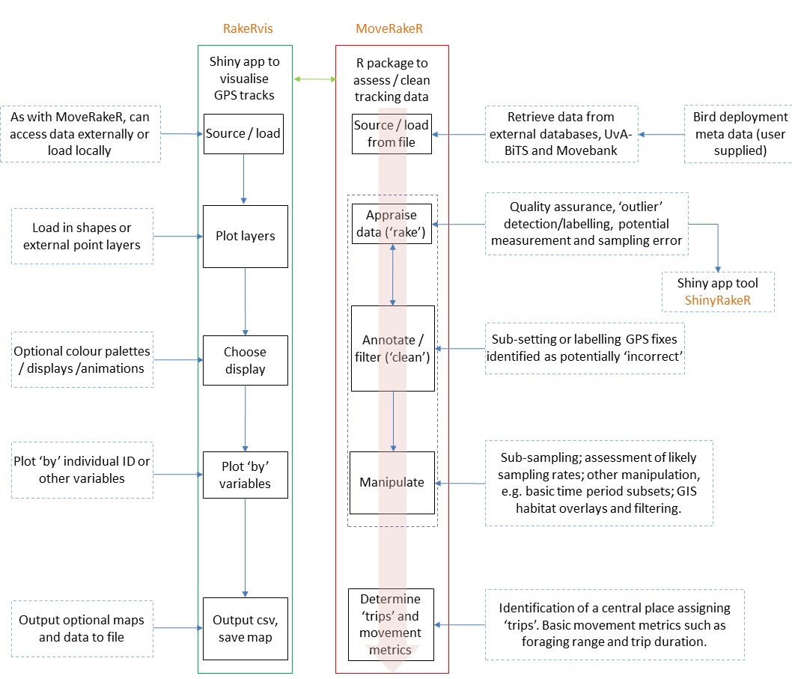
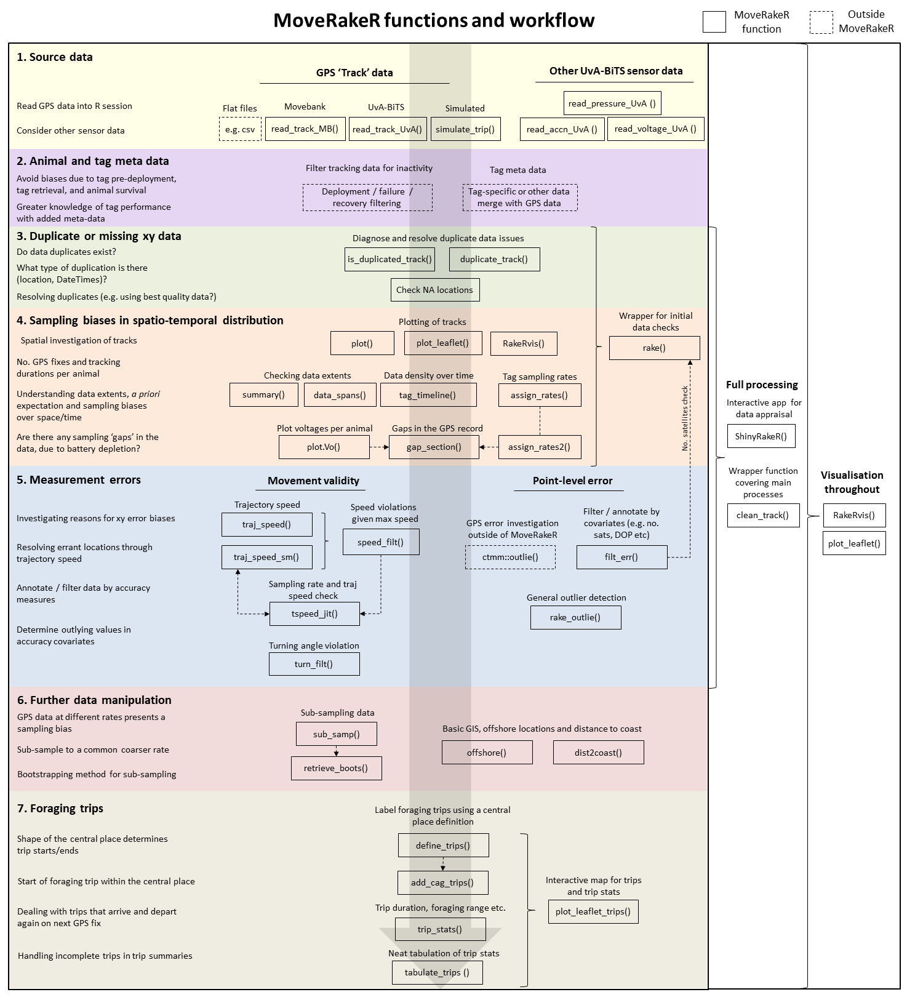
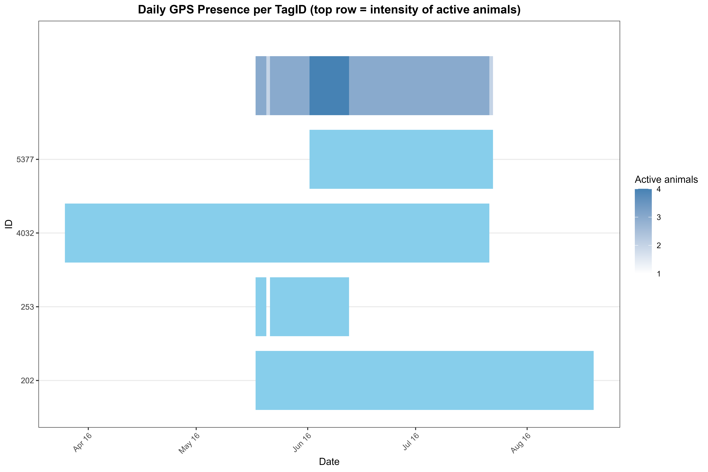
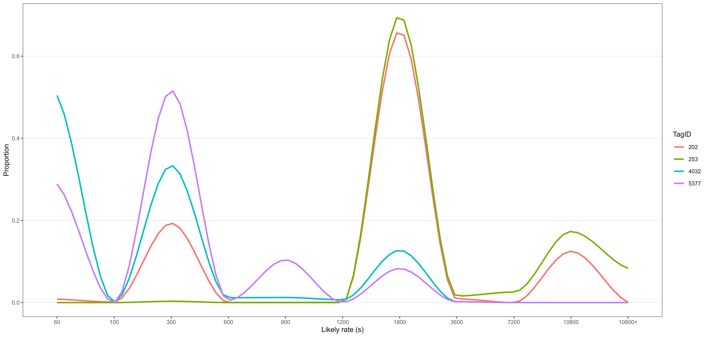
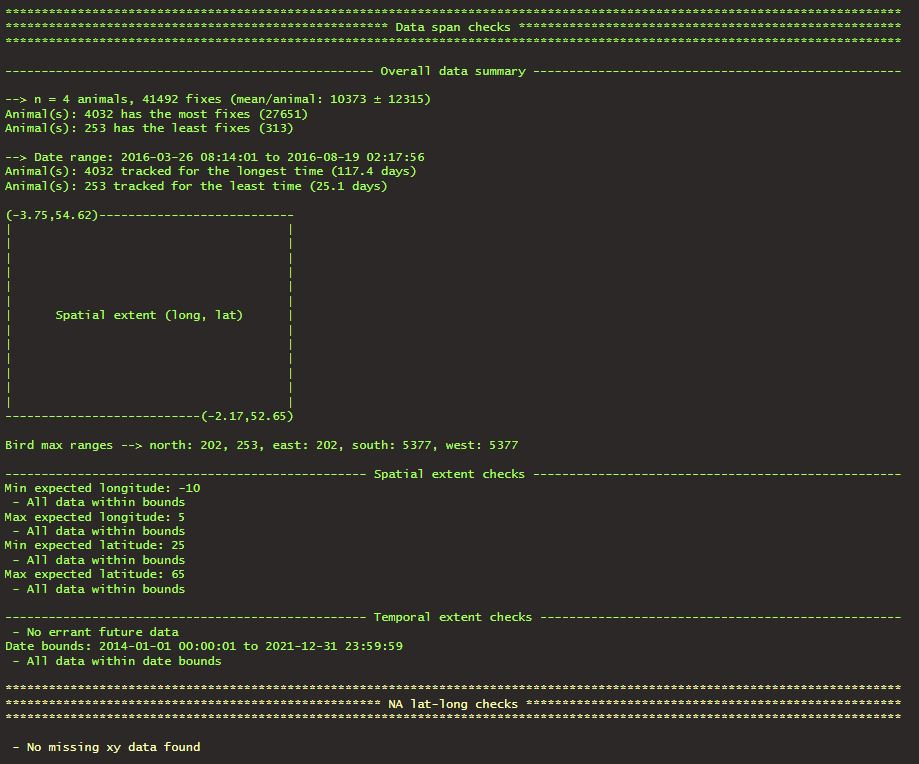
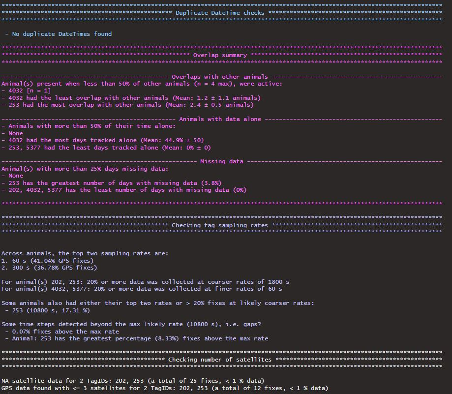
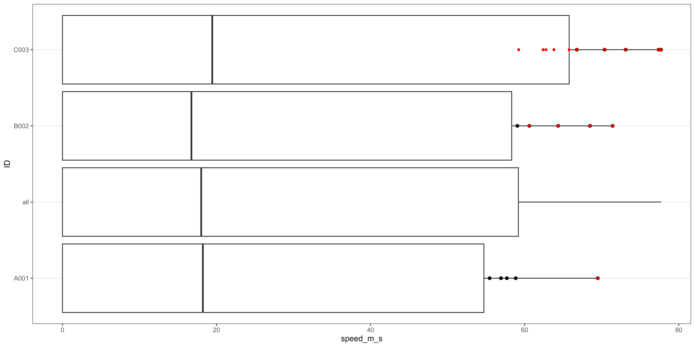

```{r setup, include=FALSE}
knitr::opts_chunk$set(echo = TRUE)

knitr::opts_chunk$set(
  collapse = TRUE,
  comment = "#>",
  eval = identical(Sys.getenv("NOT_CRAN"), "true")
)

```

## Introduction

There many reasons why animal-borne telemetry locations may have error. For location information received from GPS systems these can include internal firmware settings of tags relating to connection with satellites i.e. location quality, the number of satellites, their position in the sky, along with external factors such as temperature, humidity etc. Further issues relating to sampling biases such as  the sampling frequencies specified upon deployment of tags, and data gaps in coverage related to battery depletion or overall sampling set up, samples sizes of birds tracked and when in time they were studied. Further issues may relate to duplication of data received and missing or corrupted information. Together these issues combined present a challenge to analysts to identify, remove or account for such errors and biases ahead of addressing the intended research question. A series of tools are included in ```MoveRakeR``` to assist with this task. Below is a schematic that outlines the overall approach:

{width=80%}


## Open code vs functions

As an upfront disclaimer ```MoveRakeR``` does not assume to be able to solve all problems with trajectory data. There are many 'quirks' to such data that may be specific to your case. For example, you may expect fixes to occur only in one habitat, yet an erroneous fix appears elsewhere having cleared all other checks. Some of these issues may therefore require open coding outside of ```MoveRakeR```, and some issues we may not have even encountered yet. However, ```MoveRakeR``` can be seen as a guiding hand through some of the initial tasks to make life easier and hopefully code more terse and repeatable. 

There is therefore a need for bespoke investigation into your data. This we term 'raking' i.e. being a non-destructive process of seeing what errors may be apparent in the data and/or how the resultant dataset would look if you applied cleaning 'treatment' x, y, or z. These checks can be carried out partly using the ```ShinyRakeR``` built-in shiny app. However, as all good analysts that we are, we naturally want to delve into our data in whatever way best suits to wrangle potential issues. There exists therefore a balance between use of set tools within ```MoveRakeR``` and those initial 'open-code' investigations. 

## Order of play 

Many of the processes in ```MoveRakeR``` can be done in parallel, however certain tasks such as assessing duplication issues should ideally come first. The tasks can be split further into whether you are carrying out general data investigation and basic summaries, or delving further into sampling biases or data measurement errors. The following schematic below lays out the function landscape in ```MoveRakeR```. As there are a lot of functions, these have been separated into key tasks so as not to overwhelm or confuse.

{width=110%}

## 1. Sourcing data

### Flat files

Within ```MoveRakeR``` there are a number of ways to get your data into R. The most obvious of these is simply to import it as a .csv or other format. As long as you have a dataset with the following columns: TagID, DateTime, latitude and longitude, you can feed your data through the processes. However if using a .csv, first the data will need converting to the class “Track” so that the rest of the functions can recognise and make use of methods for that class.

```{r MoveRakeR .csv example, eval=FALSE, echo=TRUE}
data <- read.csv(data.csv,sep = ",", header=TRUE)
data <- Track(data)

```

### Built-in functions

There are a number of sourcing scripts that allow data to be read in from databases, for which the two currently implemented are MoveBank and the University of Amsterdam Bird-tracking System database (UvA-BiTS).

For the UvA-BiTS connection, you will need to first have to have access to the postgreSQL sever and then follow the steps outlined under ?read_track_UvA to set up an ODBC connection using R package ```RODBC```. The Movebank login details are also required for use and create this calling:

```{r MoveRakeR rodbc example, eval=FALSE, echo=TRUE}
library(RODBC)
db <- odbcConnect("GPS") # if you called your connection "GPS"

library(move)
login <- movebankLogin("username","password")

```

Data can then be sourced

```{r MoveRakeR read_track_UvA example, eval=FALSE, echo=TRUE}
TagID <- c(5379, 5382, 5367)
start <- c("2016-06-01 13:53:50", "2016-06-15 12:22:13", "2016-06-05 08:07:23")
end <- c("2016-07-15 09:17:14", "2016-07-20 01:08:58", "2016-07-18 14:22:45")
dataUvA <- read_track_UvA(TagID, start=start, end=end, pressure = FALSE)

```

Similarly, ```MoveRakeR``` has a means of reading data from Movebank. The ```move``` and ```move2``` are likely your first choice to do this. However, if need be, ```MoveRakeR``` can also source in data directly through the ```read_track_MB``` function:

```{r MoveRakeR read_track_MB example, eval=FALSE, echo=TRUE}
TagID <- c(202, 278, 253)
start <- c("2016-06-01 13:53:50", "2016-06-15 12:22:13", "2016-06-05 08:07:23")
end <- c("2016-07-15 09:17:14", "2016-07-20 01:08:58", "2016-07-18 14:22:45")
repo = "BTO - North West England 2016 - Lesser Black-backed Gull"
dataMB <- read_track_MB(TagID, start=start, end=end, repo = repo)

```

### Other UvA-BiTS data

For UvA-BiTS data, tags may have collected pressure, acceleration and voltage information. Further functions are available to source these directly from the database through ```read_accn_UvA()```, ```read_pressure_UvA()``` and ```read_voltage_UvA()```.

### Simulated data

A data simulation approach is also available in ```MoveRakeR``` to simulate some random data with an element of biological realism using function ```sim_data()```. 

```{r MoveRakeR sim_data() example, eval=FALSE, echo=TRUE}
data <- sim_data(
  hub_lat = -54.5, hub_lon = -36.1, # central place 'hub'
  dt = 300, # seconds GPS rate
  animals = c("A001", "B002"),
  points_per_trip = 100,
  n_trips = 10,
  max_speed = 50, # m/s
  cp_time_mean = 5, # hours
  cp_time_sd = 1 # variation
)
```

## 2. Animal and tag meta data

Within ```MoveRakeR``` there are no functions for how you may want to deal with deployment periods of animals tracked. This is up to you, but the next stage would be to remove any periods (if not already) where the data collected are pre-deployment, or post-deployment, the latter for example relevant if a tag is known to not be on the animal anymore, or if the animal did not survive.

## 3. Duplicate or missing xy data

A very early task in the pipeline should be to check that your data have a valid DateTime sequence. It may be preferable to avoid doing initial sorting by timestamps within animals to allow these initial first checks to be made and address any issues such as data jumps in time. 

Issues with timestamps (hereafter "DateTimes" using ```MoveRakeR``` lingo) can be flagged to a certain degree using some simple code. For example this could include a flag and summary of the number of rows per animal that duplicate DateTimes and if the same DateTimes have multiple distinct coordinates.

```{r MoveRakeR rake(), eval=FALSE, echo=TRUE}

data_dup <- data %>%
  group_by(TagID) %>%
  mutate(
    # Identify duplicates at the same timestamp 
    is_duplicated = duplicated(DateTime) | duplicated(DateTime, fromLast = TRUE),
    
    # Assign an instance number only for duplicates
    duplicated_instance = ifelse(is_duplicated, row_number(), NA_integer_),
    
    # Check if the same timestamp has multiple distinct coordinates
    coord_conflict = n_distinct(latitude, longitude) > 1,
    
    # Time difference from previous fix to detect out-of-order
    time_diff = as.numeric(difftime(DateTime, lag(DateTime), units = "secs")),
    out_of_order = time_diff < 0
  ) %>%
  ungroup()

data_dup %>%
  summarise(
    total_rows = n(),
    n_duplicates = sum(is_duplicated),
    n_coord_conflicts = sum(coord_conflict)
  )

```

All good. 

However, what do you do with such conflicts? There are also many complexities that could blow this up into quite a daunting task. What if you also discover your data jump around in time creating parallel 'truths' of the data in different valid time segments, which has been shown to occasionally happen with some devices. Or perhaps you discover there are precisely exact locations for different DateTime time stamps (which could be valid for a stationary animal but given GPS error expected may not be). As above, you could have multiple locations for the exact same DateTimes, or even the same DateTime and location, but with other columns having different data such as accuracy measures. This is all codeable but we could all come at this from different angles. How would you go about selecting the best parallel time segment, or most suitable duplicates to retain? ```MoveRakeR``` provides a solution to this through the function ```duplicate_track()``` that helps keep workflows a little less verbose. 

First we detect if there are any issues at the outset through ```is_duplicated_track()``` and ```duplicate_track()```:

```{MoveRakeR duplicate_track_1, eval=FALSE, echo=TRUE}

is_duplicated_track(data) # Boolean TRUE/FALSE

# the further duplicate_track() function is what we use for resolving duplication issues but also has
# a "detect" mode to give more details of what issues are present and a tibble summary per TagID
duplicate_track(data, mode = "detect") 

```

The ```duplicate_track()``` function uses different modes.If using "detect", this can help to diagnose problems initially, and then either "annotate" or "resolve" ```modes``` either flag up issues or deal with them via user-choices. The functions works sequentially through initially assessing if there any parallel time streams competing for valid truths of strings of data points; thereafter ```duplicate_track()``` assesses if there are duplicate locations for the same DateTimes, same DateTimes for different locations, or both duplicate DateTime and locations (with other meta data varying), and finally if full duplicate rows exist.

So you could tackle the data as you see fit, for example, annotating:

```{r MoveRakeR duplicate_track_2, eval=FALSE, echo=TRUE}

data_dup = duplicate_track(data, mode = "annotate")
              
```

Or, resolve the issues, perhaps you may have one or more of the issues flagged, so you could use a global "best quality" approach to pick certain variables in your data and use gradient quality directions of these to score locations and pick these:

```{r MoveRakeR duplicate_track_3, eval=FALSE, echo=TRUE}

# quality_vars = variables in data to be used for quality assessment
# quality_directions = directional gradient of increasing quality, 1 = better increasing, -1 = better decreasing

data_dup = duplicate_track(data, dup_method = "best_quality",
              quality_vars = c("n_sats", "accuracy", "pdop", "hdop"), 
              quality_directions = c(1,1,-1,-1), 
              annotate = FALSE)

```

The ```duplicate_track()``` function has a variety of other things handled under the hood, such as options for whether to take the first, last, or random selection for duplications identified. There are further specific function averages permitted for example directing how to handle average spatial location, here called "centroid", using mean or median or perhaps quantiles, and the same also for the average time if duplicate DateTimes are an issue; these aspects are handled through step-specific duplication handling, e.g. for where the same locations have different DateTimes:

```{r MoveRakeR duplicate_track_4, eval=FALSE, echo=TRUE}

data_dup = duplicate_track(data, dup_method_same_loc = "avg_time", time_fun = mean, mode = "resolve")

```

You are welcome to delve beneath the ```MoveRakeR``` bonnet, as much of the accessible parts of the package are written deliberately in tidyverse language to as to make that easier. Thereafter ```MoveRakeR``` functions generally *assume* that you have a continual progression of DateTimes per animal so it is best to check for spatio-temporal irregularities first. 

## 4. Sampling biases in spatio-temporal distributions

### Plotting data

Naturally you will want to plot your data, such as interactively using ```leaflet``` perhaps. It is of course fine to use repeat leaflet calls in your R scripts, but if things get repetetive, then there are helpers in ```MoveRakeR``` to make life easier using the function ```plot_leaflet()```; this just brings up a small R shiny app to visually interact and view your data, although beware large data volumes will slow things down. 

```{r MoveRakeR plot1, eval=FALSE, echo=TRUE}

plot_leaflet(data)

```

Or better still with the separate ```RakeRvis``` R package that can allow a lot more detail such as plotting by variables, filtering data on the fly, and importantly, switching to ```mapdeck``` using GL methods which can be faster for very large data:

```{r MoveRakeR plot2, eval=FALSE, echo=TRUE}
library(RakeRvis)
RakeRvis(data)

```

A genric S3 method is available for the ```Track``` data class that enables the ```plot()``` function to be called for a ```Track``` object giving a base R graphic. This also includes track direction arrows, options for colouring animals however you want, that can then be overlain over static geographic layers and GIS shapefiles.

```{r MoveRakeR plot S3 geenric, eval=FALSE, echo=TRUE}

# using a built in map
library(rnaturalearth)
ukmap <- ne_download(scale = 10, type = "land", category = "physical", returnclass = "sf")
par(mar=c(0,0,0,0))
plot(ukmap$geometry, ylim = c(50,62), xlim = c(-5,5),col = "wheat", border= "wheat")

# using the generic plot function for the S3 method for class 'Track' 
Cpal <- grDevices::colorRampPalette(c("red", "green", "blue"))
plot(Track(data), anims = "uniq", 
     Lines = TRUE, 
     gap = FALSE,
     ADD=TRUE, 
     Legend = TRUE, 
     cex_p = 0.2, 
     col = Cpal, 
     p4s = 4326)


```

### Basic summaries

It is relatively trivial to compute some basic initial summaries of your data e.g.

```{r MoveRakeR open code summary1, eval=FALSE, echo=TRUE}

library(dplyr)

data %>%
  group_by(TagID) %>%
  summarise(
    n_fix = n(),
    start = min(DateTime, na.rm = TRUE),
    end = max(DateTime, na.rm = TRUE),
    unique_DateTime = n_distinct(DateTime),
    minx = min(longitude, na.rm = TRUE),
    maxx = max(longitude, na.rm = TRUE),
    miny = min(latitude, na.rm = TRUE),
    maxy = max(latitude, na.rm = TRUE)
  )


```

Yet it requires a additional coding to do further summaries, such as mean or median gaps between consecutive fixes, with certain dispersion, such as MAD or IQR, and then add in a further population-level summary. Although that is still quite simple, ```MoveRakeR``` is here to help with a basic ```summary()``` function to avoid potential errors creeping in and keep code workflows clean:

```{r MoveRakeR summary2, eval=FALSE, echo=TRUE}

summary(data)

```

### 'Raking' data appraisal

At this point you may want to proceed in a variety of ways, such as considering general sampling biases. 

To detect issues in your data at an early stage, ```MoveRakeR``` has a wrapper function called ```rake()```. The distinction is made in ```MoveRakeR``` between appraisal of the data and further annotation and filtering of unwanted errant GPS locations. Data appraisal includes understanding potential influences of choices made from labeling potentially erroneous data - termed 'raking' - and typically comes ahead of then formally 'cleaning' the data to annotate or remove such fixes based on that initial assessment. The two processes are of course closely linked. The ```rake()``` function calls several other functions to provide an terminal window print-out overview of several key potential issues, including those covered above, such as general summaries and data duplication. The ```rake()``` function also checks data validity in time and space, temporal density of animals through time, and predicted sampling rates. We'll circle back this later, but taking a step back it is useful to go through each of these aspects in turn, again alongside potential open-code versions of how you may want to proceed.

### More detailed delving into spans of data per animal

Beyond just simple data summaries as we covered above, this can go further to look at the data gathered in relation to prior expectation of coverage (if relevant). For example to check out whether there are errant data in time:

```{r MoveRakeR open code time errant, eval=FALSE, echo=TRUE}

start_expected <- as.POSIXct("2000-01-01", tz = "UTC")
end_expected   <- as.POSIXct("2025-12-31", tz = "UTC")

now_utc <- Sys.time()

data %>%
  group_by(TagID) %>%
  summarise(
    min_DateTime = min(DateTime, na.rm = TRUE),
    max_DateTime = max(DateTime, na.rm = TRUE),
    before_expected = min_DateTime < start_expected,
    after_expected  = max_DateTime > end_expected,
    future_data     = max_DateTime > now_utc,
    issue_detected  = before_expected | after_expected | future_data,
    .groups = "drop"
  ) %>%
  filter(issue_detected)

```

Or in space:

```{r MoveRakeR open code space errant, eval=FALSE, echo=TRUE}

lat_range <- c(50, 60)     # min, max latitude
lon_range <- c(-5, 5)      # min, max longitude

data %>%
  summarise(
    min_lat = min(latitude, na.rm = TRUE),
    max_lat = max(latitude, na.rm = TRUE),
    min_lon = min(longitude, na.rm = TRUE),
    max_lon = max(longitude, na.rm = TRUE),
    lat_outside = min_lat < lat_range[1] | max_lat > lat_range[2],
    lon_outside = min_lon < lon_range[1] | max_lon > lon_range[2]
  )

```

However, a helper function called ```tag_spans()``` is available in ```MoveRakeR``` to help with this task through *xra* and *yra* as two-length vectors for the min and max of the x and y ranges _expected_ for the data, and temporal bounds via the *dates* argument. The ```tag_spans()``` function also considers the general summary of the data as we covered earlier, via the "general" measure.

```{r MoveRakeR tag_spans(), eval=FALSE, echo=TRUE}

data_spans <- tag_spans(
  data,
  measure = c("general", "spatial", "temporal"),
  xra = c(-10, 5),
  yra = c(25, 65),
  dates = c("2014-01-01 00:00:01", "2021-12-31 23:59:59"),
  buffer_days = 2,
  tz = "UTC",
  max_show = 3,
  messages = TRUE,
  #verbose=TRUE,
  mode = "summary", # gives summary output, otherwise options = "resolve" (i.e. filter out bad) or "annotate" flag
  msg_col = 33
)

```

You may also be interested in the overall intensity of tracking of animals and where in the season most animals have data, which may be useful in assessing sampling coverage. For example per hour count of fixes, which is a rather basic example given that sampling rates could vary:

```{r MoveRakeR open code tag_timeline, eval=FALSE, echo=TRUE}

data %>%
  mutate(hour = lubridate::floor_date(DateTime, "hour")) %>%
  count(TagID, hour, name = "n_fixes")

```

You may be interested in when the key period of data coverage was though time, from a sampling perspective this could be quite illuminating. For example you may wanting to quantify a population-level spatial assessment of area use, but that has tails of the season when such coverage may be biased to fewer individuals. Quickly this becomes more of a task to code up. Therefore ```MoveRakeR``` can help out through the ```tag_timeline()``` function, which produces a visualisation through time using ```ggplot```. 


```{r MoveRakeR tag_timeline(), eval=FALSE, echo=TRUE}
data_timeline <- tag_timeline(
  data,
  plot = TRUE,
  return_plot = TRUE,
  overlaps = FALSE,
  date_breaks = "6 month",
  messages = TRUE
)

```

The ```tag_timeline()``` has a handy *plot* argument using ```ggplot2``` to help visualise the spans of data over the deployment window. For example:

{width=100%}

This can help understand which birds contributed to parts of the time series. However, ```tag_timeline()``` further assesses temporal overlaps between animals in the supplied dataset to build on that temporal bias assessment, aided through a series of overlap tests.

First, a test is performed for the animals that are present with less than X% of other animals were active, as a gauge to how sparse parts of the dataset are. This is controlled by the *active_thresh* proportion argument (between zero and 1). Animals with the least and most overlaps with other animals across their deployments are also quantified. Next, the function assess animals with more than Y% of the time alone, determined by the *alone_thresh* proportion argument. The animals with the most and least days tracked alone are also given. Finally, the ```tag_timeline()``` function gives an indication of potential missing data at the day level, by checking how many days of missing data are present in the GPS record, with the animals with more than Z% days - via the *miss_thresh** argument - of missing data determined, and again those animals with the most and least days of missing data. 

```{r MoveRakeR tag_timeline()2, eval=FALSE, echo=TRUE}
data_timeline <- tag_timeline(
  data,
  plot = FALSE,
  return_plot = TRUE,
  overlaps = TRUE,
  active_thresh = 0.5,
  alone_thresh = 0.5,
  miss_thresh = 0.25,
  msg_col = 34,
  max_show = 3,
  date_breaks = "6 month",
  messages = TRUE
)
```

The output relating to ```tag_timeline()``` and also from ```rake()``` reflects the above threshold decisions and provides a tabulated data form of the printed terminal window summary. 

### Checking sampling rates

Rates of tags can be initially hard set on tag deployment, or in some cases re-programmed via a switch either from a spatial geofence, temporal window, or direct user remote reprogramming to upload different GPS settings, such as the rate i.e. frequency at which GPS data is collected ('rate'). 

It may be the user is well aware of the rates within the tags, or already have columns for these changes. If not, it is quite easy to assign some bins to your data and count up numbers of fixes on pre-defined rates. 

```{r MoveRakeR open code assign_rates, eval=FALSE, echo=TRUE}

rate_bins <- c(5, 10, 30, 60, 120, 300, 600, 1800, 3600)

data_rates <- data %>%
  arrange(TagID, DateTime) %>%
  group_by(TagID) %>%
  mutate(
    dt_secs = as.numeric(difftime(DateTime, lag(DateTime), units = "secs")),
    rate_bin = sapply(
      dt_secs,
      function(x) rate_bins[which.min(abs(rate_bins - x))]
    )
  ) %>%
  ungroup()

sampling_summary <- data_rates %>%
  filter(!is.na(rate_bin)) %>%
  count(TagID, rate_bin, name = "n_intervals") %>%
  arrange(TagID, rate_bin)


```

But this can get a little trickier with potential tolerance of rates given GPS often doesn't sampling precisely at rates specified given communication with satellites. ```MoveRakeR``` has a function to guess at these likely rates, through simple cuts in the data through the ```assign_rates()``` function, using the *breaks* and *tol* arguments. 

```{r MoveRakeR assign_rates more, eval=FALSE, echo=TRUE}
assign_rates(data, breaks = c(1,60,300,900,1200), tol = 0.2, out = "summary")

```

An extension of the above function is given as ```assign_rates2()```, which was added to take the ```assign_rates()``` output and do some further helpful summaries. This includes the top two most frequently used sampling rates per animal, and highlights those with tags that collected data at coarser rates. A quick flag up of potential gaps in the data is also made, hinted at through time steps between GPS fixes within animals that exceed the maximum dt value supplied. The defaults assume data are collected at rates at reasonably quick i.e. within the calendar day, but these can be customised. 

```{r MoveRakeR assign_rates2 2, eval=FALSE, echo=TRUE}
data_rates <- assign_rates2(
  data,
  by = NULL,
  split = FALSE,
  group_after_gap = FALSE,
  breaks = c(1, 60, 100, 300, 600, 900, 1200, 1800, 3600, 7200, 10800),
  tol = c(0, 0.5, rep(0.4, 2), rep(0.3, 5), rep(0.2, 2)),
  out = "summary",
  pctn_rate_thresh = 20,
  max_show = 3,
  plot = TRUE,
  messages = TRUE
)
```

The outputs of rate assignment are summarised back to the user. Note also that ```assign_rates2()``` also returns a plot summarising rates per tag using ```ggplot2```.

{width=100%}

### The ```rake()``` function

As mentioned earlier, the ```rake()``` function is a wrapper calling various others that can also be used in isolation if need be as above. ```rake()``` considers: spans of tracking data, if NA latlongs are present, if any duplicate data are present using ```duplicate_track()``` and can assess a broad timeline assessment of when birds were tracked, and if there were times when fewer or more were tracked through calls to the standalone ```tag_timeline()``` function. The ```rake()``` function also gives the user an idea of the summary of data quality extent in space and time with the ```tag_spans()``` function, as well as idea of potential rates the GPS tags were set to through use of the ```assign_rates2()``` function, and number of satellites used. Finally, ```rake()``` provides a summary of the number of satellites used for GPS fixes and any data with NAs in the satellite column checked, as well as those animals with tags that had GPS data less than a deemed minimum number of satellites. 

The overall ```rake()``` call is simply:

```{r MoveRakeR rake()1, eval=FALSE, echo=TRUE}

rake_summary <- rake(data)

```

It is advisable for the user to check carefully arguments within ```rake()``` to match checks required for the data at hand. The ```rake()``` function has defaults to check for all elements noted above (xyt spans, NA latlongs, duplicate data, timelines, rates and number of satellites), detailed in the *check_for* argument. This may look something like:


```{r MoveRakeR rake() full, eval=FALSE, echo=TRUE}

rake_summary <- rake(
  data,
  check_for = c("spans", "NAlatlong", "duplicates", "timeline", "rates", "nsats"),
  xra = c(-10, 5),
  yra = c(25, 65),
  dates = c("2014-01-01 00:00:01", "2021-12-31 23:59:59"),
  buffer_days = 2,
  max_show = 3,
  plot = FALSE,
  return_plot = TRUE,
  overlaps = TRUE,
  active_thresh = 0.5,
  alone_thresh = 0.5,
  miss_thresh = 0.25,
  breaks = c(1, 60, 100, 300, 600, 900, 1200, 1800, 3600, 7200, 10800),
  tol = c(0, 0.5, rep(0.4, 2), rep(0.3, 5), rep(0.2, 2)),
  pctn_rate_thresh = 20,
  sat_col = "satellites_used",
  drop_sats = 3,
  messages = TRUE,
  msg_col = c(32, 33, 34, 35, 36, 37)
)

```

The terminal window output should look something like the following (here using some 'real' data):

{width=80%}

{width=80%}

### Gaps in the data

Another sampling issue prevalent is to do with potential DateTime gaps that may occur in your data. This is a common issue for GPS data reliant on sustaining battery power typically through solar charging. Gaps can occur for many reasons, but a simple one is that the battery has dropped below that required to sustain the GPS receiver resulting in a hiatus in recording beyond that originally programmed. ```assign_rates2() ``` can flag potentially "gappy" parts of your track. A too large gap between GPS fixes will introduce bias into the picture given the animal may have carried out various behaviours that would be missed by just joining up two dots or risk introducing unwanted noise into the dataset through interpolating over space. 

A judgement call will therefore need to be made as to what gap is deemed suitable in your data to avoid erroneously considering the movement between two fixes as legitimate. However, as with other processes, ```MoveRakeR``` handles additional complexity, such as tolerance values in the gap, through ```gap_section()```. Gaps may frequently need to be defined or assigned differently perhaps for different analyses, making the use of such code as a function more important to de-clutter your workflow. The ```gap_section()``` function labels valid sections of proper GPS function, and if a gap is found, a new section will start. This numbering process, and 'gap_section' notation is the core process within ```MoveRakeR``` for which many processes are carried out within gaps within an animal, based on the threshold chosen by the user. The heart of the function is:

```{r MoveRakeR gap_section(), eval=FALSE, echo=TRUE}

  GAP = 450 # seconds maximum gap between consecutive fixes within an animal

  data_gapped = data %>%
    group_by(TagID) %>%
    mutate(dt = as.vector(difftime(lead(DateTime), DateTime, units = 'secs')) ) %>% #.$dt
    mutate(gap = if_else(dt > GAP,1,0), rn_ = row_number()) %>%
    mutate(gap = if_else(rn_ == max(rn_), 1, gap))  %>%
    ungroup() %>%
    mutate(gap0 = gap, gap = lag(gap)) %>% # ensures the gap is labelled in next row for correct gapsec labelling
    group_by(TagID) %>%
    mutate(gap_num = case_when(gap == 1  ~ row_number() ),
           gap_num = if_else(min(row_number()) == row_number(), row_number(), gap_num)) %>% 
    tidyr::fill(gap_num) %>%
    mutate(gapsec = consecutive_id(gap_num), gap = gap0) %>% # set gap back to what it was - used in other programs
    dplyr::select(-c(gap_num, rn_,gap0)) %>%
    group_by(TagID)

```

This of course could just be coded openly, but given the repeated calls to such code, it is neater just to call it as a function: 

```{r MoveRakeR gap_section()2, eval=FALSE, echo=TRUE}

data_gapped <- gap_section(data, GAP = 450, tol = 0, drop_single_gap = TRUE)

```

The ```gap_section()``` function also handles whether to retain points that become isolated on their own as a gapsection, via drop_single_gap = TRUE. Gaps are also important to get right when it comes to defining foraging trips on your data, if that is needed, as computing a trip to and from a central place that has a gap can potentially cause misleading interpretation of metrics such as trip duration and foraging range.

## 5. Measurement errors

### Movement validity: speed and turning angle filters

Erroneous data points may be clearly visible in your data by irregular jumps in 2D space. If that happens, a common approach is use a trajectory speed filter to consider the maximum speed of the animal studied, and investigate whether the speed between consecutive points is valid for the animal. Any points that suddenly jump in space will be flagged this way as erroneous. The first job is to assess the distance / time between fixes, which can be done as:

```{r MoveRakeR open code traj speed, eval=FALSE, echo=TRUE}

data <- data %>% 
    group_by(TagID)
    mutate(
      dist = if (n() > 1) {
        c(geosphere::distHaversine(cbind(longitude, latitude)), NA)
      } else {
        NA_real_
      },
      dt = as.numeric(difftime(lead(DateTime), DateTime, units = "secs"))
    )

  data <- data %>% mutate(traj_speed = dist / dt,
                          traj_speed = lag(traj_speed, default= NA_real_)) # pad with '1' at the start, removing last row


```

Or in ```MoveRakeR``` using the the ```traj_speed()``` function for ease, that also allows consideration of gaps previously identified:

```{r MoveRakeR traj speed(), eval=FALSE, echo=TRUE}

data = traj_speed(data, within_gap = TRUE)

datatraj_speed[1:5] # added column

```

This "raw" trajectory speed filter is sensitive to single bad data spikes, and may alone be enough for your needs. However, the raw trajectory approach may not capture instances where there may be localised jitter and several fixes in a row may be slightly 'wrong'. In this case, considering a further smooth or RMS (root mean square)
is useful to answer a slightly different question in that: "is there sustained implausible movement in the
neighbourhood for this fix?". And so further options are available to use RMS or smoothing of trajectory speed
instead of or alongside (preferable) to the default setting of using the raw trajectory speed values. The McConnell filter (McConnell et al. 1993) follows this approach using an RMS for two points either side, excluding the current fix to use as a search window before and after the current fix. A further function is therefore given as ```traj_speed_sm()``` to carry out such "smoothing". This is therefore a context detector not a spike detector.

```{r MoveRakeR traj_speed_sm(), eval=FALSE, echo=TRUE}

data = traj_speed_sm(data, method = "mcconnell")

datatraj_speedSM[1:5] # added column

```

Within ```MoveRakeR``` you can build RMS or smooths from whatever function you want, for example:

```{r MoveRakeR traj_speed_sm()2, eval=FALSE, echo=TRUE}

# Rolling median
fun_rollmean <- function(x, y, k = 5){
 frollapply(y, n = k, FUN = mean, align = "center", fill = NA)
}
 
data = traj_speed_sm(data, fun = fun_rollmedian, fun_args = list(k = 7)) 


```

So far, we have just added in extra columns into the data without actually doing anything with them. The further function ```speed_filt()``` can be called in place of ```traj_speed()``` and ```traj_speed_sm()```, which calls them anyway. Thus, ```speed_filt()``` can be called on its own to either annotate or filter data based on a perceived threshold of maximum travel by the animal:

```{r MoveRakeR speed_filt(), eval=FALSE, echo=TRUE}

# fastest using only 'raw' traj_speed deafult and annotating is default
dat_speed_filt_1 = speed_filt(data, detailed_verbose = TRUE,  annotate = TRUE, sp_thres = 50) 

# using a hybrid approach (not default) with 'raw' traj_speed and traj_speedSM from method = "mcconnell" (default)
dat_speed_filt_2 = speed_filt(data, hybrid = TRUE, annotate = TRUE, detailed_verbose = FALSE,  method = "mcconnell", sp_thres = 50) 

```

The ```speed_filt()``` function works using a while loop to sequentially remove trajectory speeds more than the sp_thres max value (here taking the default of 50 m/s, but choose that wisely!). For the hybrid approach, fixes are flagged (or removed if annotate is FALSE) if one or other of the smoothed or raw trajectory speed columns are flagged, i.e. 

```{r MoveRakeR speed_filt()2, eval=FALSE, echo=TRUE}

if(hybrid){
  data_dp$speed_rm <- ifelse(
    data_dp$speed_rm_raw == 1 | data_dp$speed_rm_sm == 1,
    1, 0
  )
}

```

Other R packages also cover some similar ground such as R package ```trip``` which is advisable to check out. ```MoveRakeR``` just builds in a few extra bells and whistles.

The trajectory speed of animals may be less straight-forward to assess over changing sampling rates of tags i.e. irregular trajectories with varying time differences between GPS relocations. Although rather obvious, it is worth noting that with very small GPS sampling intervals such as a few seconds, and particularly with a stationary animal, having a smaller denominator in the distance / time calculation combined with the fact that GPS jitter from error relating to satellite communications, can result in potentially more erratic trajectory speeds at smaller sampling rates. These may even violate the upper "sp_thres" value. This is a well-known issue, but a further function ```tspeed_jit()``` can help to unpick this bias through introducing a 'jitter' of random noise as around the GPS fixes after which the data is then bootstrapped to assess the effect on the trajectory speeds. 

```{r MoveRakeR tspeed_jit(), eval=FALSE, echo=TRUE}

test = tspeed_jit(data_in, nsim = 50)

```

A non-linear function can then be fitted to assess the relationship in variance from the true trajectory speed, and can inform the trajectory speed filter usage. However, it may also be worth considering the ```traj_speed_sm``` and e.g. McConnell filter that may pick out such sustained trends in the data.

```{r MoveRakeR tspeed_jit()2, eval=FALSE, echo=TRUE}

install.packages('drc')
library(drc)

# Fit an exponential decay model
model <- drm(value ~ rate, data = test, fct = EXD.3()) # Warning: obviously not accounting for pseudoreplication
summary(model)
plot(model)

```

On the subject of trajectory filtering, there is also a turning angle filter that is built into ```MoveRakeR``` should you so need it. This either annotates or removes GPS fixes that are above or below turning angles between consecutive fixes.

```{r MoveRakeR turn_filt(), eval=FALSE, echo=TRUE}

# direction less_than the turnFilt value for which to annotate 
data_turn_test <- turn_filt(data, turnFilt = pi/4, turnFilt_dir = "less_than", annotate = TRUE)

```

### Point-level error

The above section for speed filtering partly touched on direct GPS error assessment. Further R packages have covered such issues, such as ```ctmm``` for which ```MoveRakeR``` does not seek to replicate. In particular the ```ctmm::outlie``` function may be of particular use:

```{r ctmm outlie, eval=FALSE, echo=TRUE}
library(ctmm)
library(MoveRakeR)
data(buffalo)

# Outliers in Cilla
OUT <- outlie(buffalo[[1]])

# convert a Track object to move format for use in ctmm::outlie
data_2move <- MoveRakeR::Track2move(data)

test_ctmm <- ctmm::as.telemetry(data_2move)  # convert to ctmm from move
OUT <- ctmm::outlie(test_ctmm, plot = FALSE)

```

Beyond GPS-specific error, more general meta data or covariates that may be available for your data to inform quality of rows to retain, such as accuracy measures, number of satellites or their configuration in the sky via DOP values. Such data may or may not be available for certain tag types. A common assumption is that three satellites is poor for position and so can be filtered out on principle. The filtering or annotating of data via additional columns is entirely up to you and can be covered in open code fine. For example:

```{r simple flags, eval=FALSE, echo=TRUE}

# mock example:
acc_thresh = 5

dat_flagged <- dat %>%
  mutate(
    flag_n_sats  = n_sats < 4,
    flag_acc     = accuracy < acc_thresh,  
    flag_hdop    = HDOP > 7,
    flag_pdop    = PDOP > 7,

    flag_errant = flag_n_sats | flag_acc | flag_hdop | flag_pdop
  )
  
```

As always, ```MoveRakeR``` has an option for coding this in a cleaner way if you so wish called ```filt_err()```, which was written to dovetail into the ```clean_track()``` workflow below for cleaner internal processes for labelling of errant data from named columns. No offence will be taken if you choose to stick with open code on this one though :).

```{r filt_err(), eval=FALSE, echo=TRUE}

# here flag is a value in the data already as a "right" or "wrong" showing the use of character variables
# "flag_flt_switch()" is a custom function showing how the vals arguments can accept functions

flag_flt_switch <- function(x){
 flag <- as.integer(!(is.na(x) | x == 0))
 return(flag)
}
  
test5 = filt_err(data,
   nms = c("speed_accuracy", "flag", "satellites_used", "flt_switch"), # named columns to flag on
   vals_l = list(NULL,NULL,4,NULL),                                    # lower bound per variable
   vals_u = list(11,"wrong",NULL,flag_flt_switch)                      # upper bound per variable
)

```

Beyond the covariates in the data, the assessment of data quality may stray into outlier assessment. This is a much wider topic. However, a function is avaiable in ```MoveRakeR``` called ```rake_outlie()``` which is concerned with the overall distribution of covariate data. 

The ```rake_outlie()``` function enables a relatively basic further delve into what may be driving outlying points within variables in the data. Outlier detection is not always straightforward as there are many approaches available, and can depend on the distribution of your data. Approaches include statistical tests than can require assumptions of normality, such as z-scores. An interesting vignette is available (Soetewey 2020) that describes many of the available methods and other R packages, such as ```outliers``` (Komsta 2022), ```DMwR::lofactor``` (Torgo 2010), ```mvoutlier``` (Filzmoser & Gschwandtner 2021), ```odetector``` (Cebeci et al. 2022), ```Rlof``` (Hu et al. 2022) and probably many more.

The ```rake_outlie()``` function is concerned with the overall distribution of covariate data, which may include data such as speed derived from telemetry processes, or some other independent covariate that may require investigation. ```rake_outlie()``` implements three simple approaches, "quantile", "boxplot", and "Hampel". 

The use of outlier tests will depend on your underlying data, as tests will typically detect 'some' data points as being outlying even for 'good' data. This calculation is performed for individual animals and then in relation to the total population. The resultant output therefore gives the user an indication of outlier presence within individual in relation to the population. For example below using the quantile method within set lower and upper *q* limits:

```{r MoveRakeR rake_outlie() 2, eval=FALSE, echo=TRUE}

fake_data <- sim_data(
  hub_lat = -54.5,
  hub_lon = -36.1,
  dt = 300,
  animals = c("A001", "B002"),
  points_per_trip = 100,
  n_trips = 10,
  max_speed = 50,
  cp_time_mean = 5,
  cp_time_sd = 1
)

data_o <- rake_outlie(fake_data, var = "speed_m_s",  u_max = NULL, q = c(0.01,0.99), method = "quantile",
                         plot = TRUE, annotate = TRUE, summary = TRUE, verbose = FALSE)


data_o$outlier_i_speed_m_s_q  # outliers outside individual range
data_o$outlier_ia_speed_m_s_q # outliers outside individual range + outside the all-animal range

                         
```                     

The above returned output in *data_o* is an annotation of the data (annotate = TRUE) for that covariate relating to upper and lower outliers, although a summary data.frame is also returned (summary = TRUE). Further, a plot argument can return the plot to the user, accessible through the returned object's nested attributes. 

```{r MoveRakeR rake_outlie() 3, eval=FALSE, echo=TRUE}

attr(attr(data_o,"rake_outlie"), "plot_data")

```

{width=100%}

This is a "boxplot-style" plot although here being quantiles of lower (1%), middle (50%) and upper (99%) bounds - as specified using *q* above. This plot can highlight how the function is treating outlying fixes (circles) beyond, in this case quartile extremes, and labeling them (red) per individual beyond the distribution across 'all' animals.

A summary option is also available under the attributes, that contains a summary of the proportion of GPS fixes (for that covariate) that were outlying for the individual animal's distribution and in relation to the population-level distribution.

```{r MoveRakeR rake_outlie() 4, eval=FALSE, echo=TRUE}

attr(attr(data_o,"rake_outlie"), "summary")

```

Only one variable can be supplied to the function at a time, and only one method per covariate can be specified. Care should be taken in the use of ```rake_outlie()``` and individual methods ideally should be tested alongside others and full plotting and scrutiny of the data distributions should be carried out.

What ```rake_outlie()``` does help with, is the summary of covariate data *within* and *between* animals, which can help show, in a non-parametric way at least, the animals that may have greater error for certain variables from the 'population' of animals tracked.

### The ShinyRakeR app

There is a standalone R shiny app called ```ShinyRakeR``` that is an interactive way of assessing the consequences visually on your track data following choices you may make in the raking process. This is detailed further in a separate vignette called "ShinyRakeR".

{width=100%}


## 'Cleaning' (filtering or annotating)

So far in 'raking' through the data, we have been mainly concerned with reporting back on potential issues with a GPS dataset. There is a bit of blur in ```MoveRakeR``` when investigation turns into formal labelling or filtering as this flow is interchangeable. At all stages throughout this process, you may have been annotating or flagging as you go, and so at this point you may already have a dataset ready to filter and end up with a 'clean' dataset to progress further with. Many of the functions in ```MoveRakeR``` have both annotation and filtering capabilities. 

It may be that having worked though this process you have a better idea of how to run a full sweep over your data to clean in one go. This is where a further function ```clean_track()``` may be of use. The function ```clean_track()``` is a general wrapper to do many labeling or filtering tasks based on pre-defined decisions made. Annotation is also at the heart of ```clean_track()``` should a filtering not yet be wanted. Note in previous versions of ```MoveRakeR``` (<1.1.3) ```clean_track()``` was named ```clean_GPS()```; the latter name is still retained for backwards compatibility.

After initial assessment of the effect of labeling of fixes as likely erroneous, options are available in ```MoveRakeR``` to carry out the basic cleaning of the data to annotate or filter fixes that may be identified less reliable. Within the ```ShinyRakeR``` app, this can also be achieved of course through an export direct to the R session. However, should such choices then be known more widely for a dataset, a quicker process is then needed to allow scripts to be generated in a more efficient and terse way. 

The ```clean_track()``` function is a wrapper process in one single function. ```clean_track()``` considers the same potential sampling or measurement error checks (the corresponding function argument given in parentheses):

- Minimum number of fixes per bird (min_fix = 0) and where to perform a check of data rows i.e. near the start or after all other filters, c("after_NA", "after_all");
- NA latitude and longitude information (NA_latlong = TRUE);
- Data duplication issues such as parallel data streams, repeated DateTimes, locations, or both;
- Tag data spans i.e. penitentially errant data in the future or in a range supplied by the user in time/space;
- Minimum satellite threshold and if checks should be performed (sat_col = "satellites_used", sat_check = TRUE, drop_sats = 3);
- Movebank specific erroneous data flags (flt_switch = FALSE);
- Dilution of precision (pdop = 0, hdop = 0);
- Treatment of single gaps (hasgaps = FALSE, GAP = 28800, tol = 0.2, drop_single_gap = FALSE);
- Use of a 'consecutive-fix 'trajectory speed filter (speedFilt = TRUE, sp_thres = 50);
- Use of a turning angle filter and removal of fixes above or below the threshold (turnFilt = NULL, turnFilt_dir = c("less_than", "greater_than");

Accepting the function defaults, filters for three satellites, removing NA latlongs and duplicate data resolving taking a random pick, considering only errant future data (nothing predifined by the user), using a speed filter at 50 m/s, assuming no gaps were defined prior in the data, and so new gaps are defined at 28800 s with a 0.2 tolerance. E.g. using ```fake_data```:

```{r MoveRakeR clean_track() default, eval=FALSE, echo=TRUE}

fake_data <- sim_data() # generate some random example data

fake_data <- fake_data %>% clean_track() # accepting the defaults of the clean_track function

```

That is obviously highly unlikely you will want to accept the defaults and it is not a good idea to just do this blindly, as at very least 50 m/s may be not be the right speed to use, for example. More refined use is therefore strongly advised.

The option also exists in ```clean_track()``` to label or filter out the fixes that meet each of the argument conditions (annotate = FALSE), or simply to annotate them (annotate = TRUE), with the default option being to filter.

```{r MoveRakeR clean_track() options, eval=FALSE, echo=TRUE}

# as an annotation tool, in detail:
data_an <- clean_track(fake_data,
                     min_fix = 5, min_fix_when = "after_NA",       # keep birds with 5 fixes or more, after NA annotation applied
                     NA_latlong = TRUE,                            # drop NA lat-longs
                     duplicates = TRUE,                            # activate duplicate search using random data pick
                     tagspans = TRUE,                              # tag spans check, default checks future data issue
                     sat_check = TRUE, drop_sats=3,                # drop fixes with  3 satellites
                     flt_switch = FALSE,                           # ignored here
                     pdop = 6, hdop = 6,                           # drop any rows above a value of 6
                     hasgaps = FALSE, GAP = 28800, tol = 0,        # no gaps defined, use an 8 h gap + zero tolerance
                     drop = FALSE,                                 # keep all gap sections identified with 1 fix (but note these are dropped anyway in speed filter if we are not annotating!)
                     dup_DT = TRUE,                                # remove duplicate DateTimes
                     speedFilt = TRUE, sp_thres = 50,              # speed filter activated with a maximum of 50 m/s
                     turnFilt = NULL,                              # No angle turning filter used
                     annotate = TRUE, attrib = TRUE,               # no annotation = dropping rows not meeting conditions, attributes of no. rows per stage retained as an attribute in final data
                     reproject = FALSE, p4s = 3035,                # no re-projection of lat longs
                     verbose = TRUE, detailed_verbose = FALSE)     # simple messaging used

```

If annotation, is used as in the above example, then the rows of the data fed in will match that returned and the function will add columns where rows have been flagged with a suffix of ("_rm"): e.g. NA_latlong_rm, all_NA_rm, tid_rm, gps_pdop_rm, etc, depending on decisions made (see function help for details), and a final combined_rm representing all combinations is built. The number of GPS fixes that are affected by each of the decisions are also stored at the bird level. This summary of number of rows remaining after each step can be activated by setting the argument "attrib = TRUE", and accessed via a call to the attributes of the returned object. This summary can be accessed after the function run by calling:

``` {r MoveRakeR clean_track() options2, eval=FALSE, echo=TRUE}

data_an <- clean_track(data, attrib = TRUE)

# check out where fixes where flagged/dropped:
attr(data_an,"data_summary")

```

As noted, ```clean_track()``` is a wrapper and many of the things this function does can be achieved outside of it as in the sections above.

## 6. Further data manipulation

### Sub-sampling

A further common task is to consider sub-sampling telemetry data done to a coarser rate. This is often used to align animals with tags that may have collected data across many different rates to facilitate analytical investigation. Although some statistical methods can deal with such complexity, it is still a common task in the wider literature to carry out such sub-sampling. Many other R packages offer these sorts of options such as ```AMT```, ```trip``` and ```move```. Why then replicate them you may ask! Or perhaps we should ask why we all keep reinventing the wheel. But within ```MoveRakeR``` we introduce a new ```sub_samp()``` function. The reason for this was again for a tidy-friendly embellishment and expansion of these approaches. The ```MoveRakeR``` approach to this is acknowledge that there are  different ways of carrying out the sub-sampling, as also highlighted within the ```ExMove``` workflow (Langley et al. 2024). ```sub_samp()``` therefore offers different methods to do the sub-sampling: (1) to 'round' the DateTimes to the nearest whole unit following ```ExMove``` alongside another original core process that (2) uses the start time of the animal as where to begin sub-sampling over different time steps. The embellishment aspect comes from a further novel method introduced that bootstraps the  data within segments along the track given that there may be many options of locations to pick that comprise a valid sub-sample.

```{r sub_samp(), eval=FALSE, echo=TRUE}

# rounding approach:
data = sub_samp(data = data, dt = 3600, tol = 0.2, method = "rounder", drop_coarser = TRUE)

# sequencer:
data = sub_samp(data = data, dt = 3600, tol = 0.2, method = "sequencer", drop_coarser = TRUE)

```

These approaches also consider whether to drop or include fixes that are already on a rate coarser than the one being sub-sampled to. Although rounding of data is a relatively easy task and the ```ExMove``` workflow (Langley et al. 2024) nicely highlights how the ```tidyverse``` can be used to do this in open code. There are potential quirks to data however that mean two competing fixes may be rounded and may result in a slight data gap being artificially introduced, and so the ```sub_samp``` function takes care of this sort of complexity.

The bootstrap approach, is perhaps a less straight-forward aspect to code openly, and so ```sub_samp()``` can do a lot of the heavy lifting for you, for example below sub-sampling to a common rate of 1800 s with a tolerance of 0.2 around that rate.

```{r sub_samp()2, eval=FALSE, echo=TRUE}

data_boot_1800 <- sub_samp(data = data, dt = 1800, tol = 0.2, method = "boot_sequencer")

```

As the bootstrapping of large data can occupy a large memory footprint, the rows are stored as vectors from the bootstrapping and so require a further function to rebuild them and generate the samples, if you are confident your PC can handle it.

```{r sub_samp()3, eval=FALSE, echo=TRUE}
  boots_1800_rate <- retrieve_boots(data_boot_1800)
```

### Other data manipulation tasks

Further GIS data manipulation is available in ```MoveRakeR``` for two commonly used tasks, again to make life a little simpler for terse workflows. In particular, ```offshore()``` is useful to assign fixes to onshore or offshore if dealing with species crossing a marine divide. A further function ```dist2coast()``` allows calculation of nearest coastline using a supplied ```sf``` shapefile.

## 7. Foraging trips

Beyond these steps the user is likely then ready to carry out out further data manipulation and in the case of central place foraging data, may be interested in defining 'trips' of animals. This is considered in a further vignette "Foraging trips".


## References

Cebeci, Z., Cebeci, C., Tahtali, Y. and Bayyurt, L. 2022. Two novel outlier detection approaches based on unsupervised possibilistic and fuzzy clustering. PeerJ Computer Science 8:e1060. <https://doi.org/10.7717/peerj-cs.1060>.

Filzmoser P, Gschwandtner M (2021). mvoutlier: Multivariate Outlier Detection Based on Robust Methods. R package version 2.1.1, <https://CRAN.R-project.org/package=mvoutlier>.

Fleming, C.H., Drescher-Lehman, J.. Noonan, M.J., Akre, T.S.B., Brown, D.J., Cochrane, M.M., Dejid, N., DeNicola, V., DePerno, C.S., Dunlop, J.N., Gould, N.P., Harrison, A.-L., Hollins, J., Ishii, H., Kaneko, Y., Kays, R., Killen, S.S., Koeck, B., Lambertucci, S.A., LaPoint, S.D., Medici, E.P., Meyburg, B.-U., Miller, T.A., Moen, R.A., Mueller, T., Pfeiffer, T., Pike, K.N., Roulin, A., Safi, K., Séchaud, R., Scharf, A.K., Shephard, J.M., Stabach, J.A., Stein, K., Tonra, C.M., Yamazaki, K., Fagan, W.F. & Calabrese, J.M. (2020) A comprehensive framework for handling location error in animal tracking data. bioRxiv 2020.06.12.130195; doi: <https://doi.org/10.1101/2020.06.12.130195>.

Fleming C.H. & Calabrese J.M. (2025) ctmm: Continuous-Time Movement Modeling. R package version 1.3.0. <https://CRAN.R-project.org/package=ctmm>.

Hu Y, Murray W, Shan Y, Australia. (2022). Rlof: R Parallel Implementation of Local Outlier Factor(LOF). R package version 1.1.3. <https://CRAN.R-project.org/package=Rlof>.

Komsta L (2022). outliers: Tests for Outliers. R package version 0.15. <https://CRAN.R-project.org/package=outliers>.

Soetewey, A. (2020) Outliers detection in R, Stats and R. <https://statsandr.com/blog/outliers-detection-in-r/#fn4>.

Torgo, L. (2010). Data Mining with R, learning with case studies Chapman and Hall/CRC. <http://www.dcc.fc.up.pt/~ltorgo/DataMiningWithR>.


